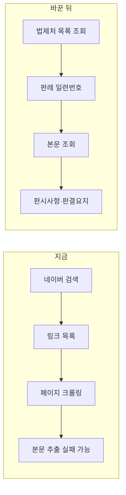
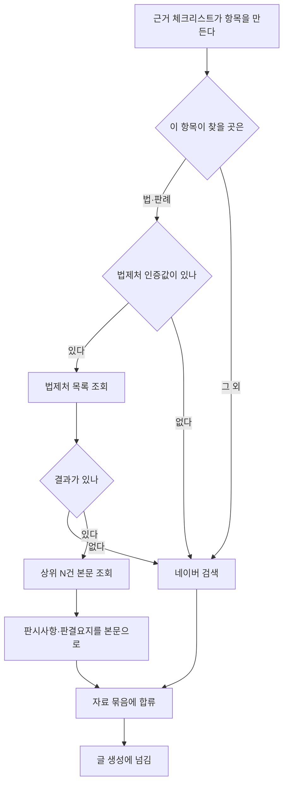

# 법령·판례를 원문에서 가져온다

## 왜 바꾸나

지금 법 근거가 필요한 항목은 **네이버 전문자료 검색**으로 대신하고
있다. 코드에는 이런 메모가 붙어 있었다.

> 국가법령정보센터는 공개 검색 API 가 없어 여기로 대신한다

사실이 아니다. 법제처가 국가법령정보 공동활용 API 를 무료로 열어 두고
있고 판례 목록·판례 본문·법령까지 조회된다.

차이는 **2차 정보와 원문**의 차이다. 퇴거 청소의 통상손모 법리, 파손
배상의 30일 기한 같은 것들은 블로그 글을 요약해 쓰면 틀린다.

## 결정적 이점 — 크롤링이 필요 없다

네이버 검색은 **링크**를 준다. 그 링크를 따라가 본문을 긁어야 한다.
법제처는 **본문을 직접 준다** — 판시사항과 판결요지를 그대로 받는다.

## 흐름

**인증값이 없거나 조회가 비면 조용히 네이버로 돌아간다.** 법제처가
막혀서 글이 안 나오는 일은 없어야 한다.

## 호출

| 하는 일 | 주소 |
|---|---|
| 목록 | `lawSearch.do?OC=..&target=prec&type=JSON&query=..` |
| 본문 | `lawService.do?OC=..&target=prec&type=JSON&ID=..` |

`target` 을 바꾸면 대상이 바뀐다 — `prec` 판례, `law` 법령,
`expc` 법령해석례.

인증값(OC)은 사용자가 정한 아이디 문자열이고 주소에 그대로 실린다.
다른 키들과 같은 자리에 보관한다.

## 본문 조회는 몇 건까지

목록이 20건 나와도 본문을 20번 부르면 느리다. **상위 3건만** 본문을
가져온다. 판례는 상위 몇 건이 그 쟁점의 대표 판례인 경우가 많다.
