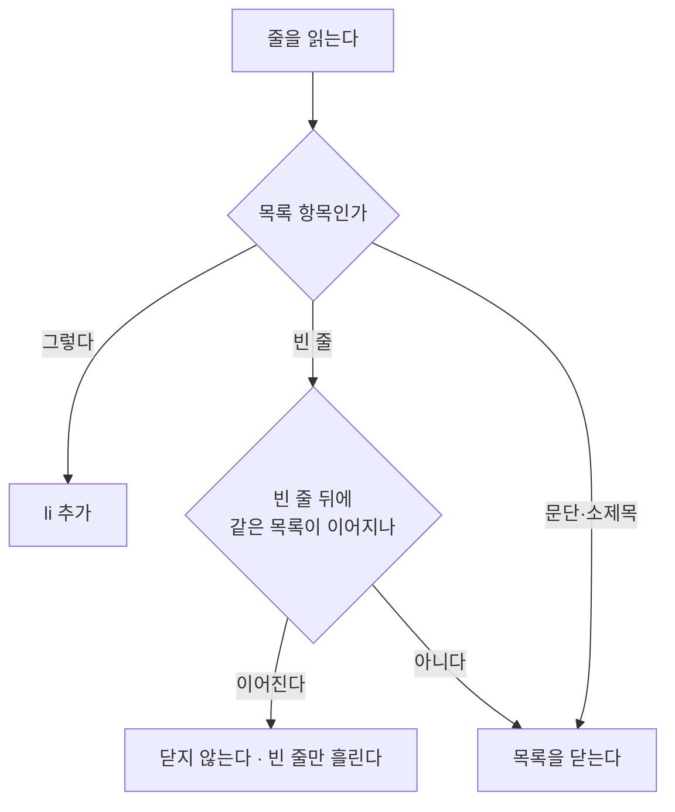

# 목록이 항목마다 쪼개진다

## 무엇이 보였나

글에 번호 목록이 나오는데 **번호가 늘지 않고 전부 「1.」** 이었다.

    1. 견적서를 문서로 받았는가
    1. 작업 인원과 차량 톤수가 적혀 있는가
    1. 사다리차가 양쪽 집 모두 포함인가

## 왜 그런가

AI 가 항목 사이에 빈 줄을 넣어 쓴다. 사람이 읽기에는 자연스럽다.

```
1. 첫째

2. 둘째
```

변환기는 줄 단위로 읽으며 **목록 항목이 아닌 줄을 만나면 목록을 닫는다.**
빈 줄도 항목이 아니므로 거기서 닫혀, 항목 하나마다 `<ol>` 이 하나씩 생겼다.
브라우저는 목록마다 번호를 다시 1 부터 세므로 전부 「1.」 로 보인다.



## 따로 쓴 두 목록은 따로 남는다

사이에 문단이나 소제목이 들어오면 그때는 닫는다. 이어 붙이면 **의도적으로
나눈 목록**까지 하나가 된다.

## 이미 나간 글

조립 지점(미리보기·저장·재발행이 함께 지나는 자리)에서 **붙어 있는 목록을
하나로 되돌린다.** `</ol>` 바로 뒤에 `<ol>` 이 오면 사이에 아무것도 없다는
뜻이라 합쳐도 안전하다.
