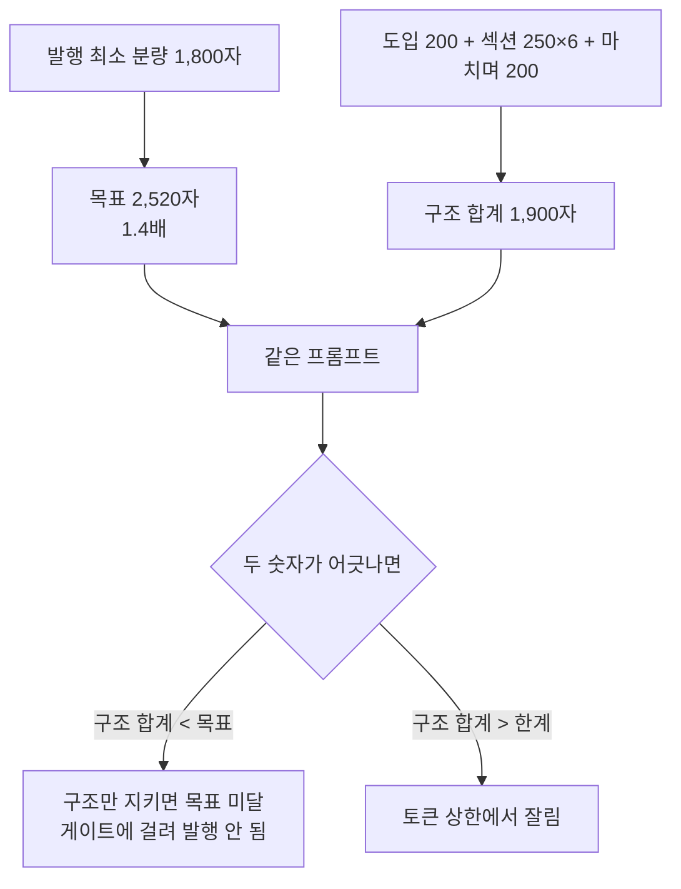

# 분량을 정하는 칸이 두 군데다

## 무엇이 어디서 정해지나

| 칸 | 있는 곳 | 하는 일 |
|---|---|---|
| 발행 최소 분량 | 고급 설정 · 본문 분량 | 이보다 짧으면 **발행을 막는다**. 이 값의 1.4배가 모델에게 줄 목표가 된다 |
| 최소 글자수(도입·섹션당·마치며) | 프롬프트 빌더 | **구조 약속** 문구를 만든다 — 「도입 200자+」「섹션 각 250자+」 |

둘은 서로를 모른다. 하나는 글 **전체**를 말하고, 하나는 **구획마다**를
말하는데, 같은 프롬프트 안에 나란히 들어간다.

## 충돌은 "덮어쓰기"가 아니라 "다른 숫자"

한쪽이 다른 쪽을 지우지는 않는다. 대신 모델이 **두 숫자를 동시에** 듣는다.

- 구조 합계가 목표보다 **작으면**: 모델이 구조 약속만 채우고 끝낼 수 있다.
  글은 나왔는데 발행에서 막힌다.
- 구조 합계가 한계보다 **크면**: 다 쓰기 전에 토큰이 끊긴다.

그래서 **두 칸은 나란히 놓여야 한다.** 떨어져 있으면 어긋난 줄 모른다.

## 한자리에 모은다

빌더에 있던 최소 글자수를 **발행 최소 분량 바로 아래**로 옮긴다.
본문 분량 블록이 이렇게 읽힌다.

    ① 발행 최소 분량        1,800자   ← 사람이 정한다
    ② 구획별 최소 글자수    도입 200 · 섹션당 250 · 마치며 200
       └ 구조 합계          1,900자
    ③ 모델에게 요구할 목표  2,520자   ← ①의 1.4배
    ④ 한 번에 쓸 수 있는 한계 약 5,400자

②의 합계가 ③에 못 미치면 그 자리에서 **경고**한다. 빌더로 가지 않아도
어긋난 것이 보인다.

값은 한 곳에만 산다 — 빌더는 이 값을 **읽어서** 구조 약속을 만든다.
두 군데서 따로 고칠 수 있으면 다시 어긋난다.
