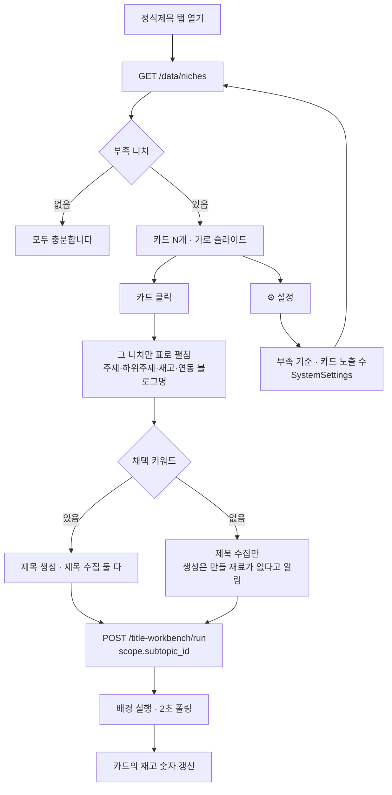

# 니치 요약탭 — 부족한 니치에서 바로 채우기

정식제목 탭 상단. **카드 하나 = 재고가 부족한 니치 하나.** 카드를 눌러
펼치면 그 니치만 표로 보이고, 그 자리에서 수집·생성을 돌린다.

카드가 보여 주는 것은 셋뿐이다 — 니치명 · 재고 · 연동 블로그 수.
"부족한 니치가 몇 개인가" 가 아니라 "무슨 니치가 부족한가" 를 답하는 화면이다.

## 왜 카드마다 따로 도는가

`_runs` 가 사용자당 하나면 두 번째 카드를 눌러도 "이미 실행 중" 만 뜬다.
카드를 눌러 가며 채우는 화면이므로 `(user_id, subtopic_id)` 로 나눈다.

## 수집 시드 — 채택 키워드가 없을 때

부족 니치 32개 중 31개는 채택 키워드가 0개다(2026-09-04 실측).
그 니치의 **카테고리 키워드**(주제 > 하위주제 > 키워드)를 시드로 쓴다.
부족 니치는 모두 3~16개를 갖고 있어 수집은 어디서든 돈다.

생성은 다르다. 채택 키워드가 없으면 만들 재료가 없다 — 없다고 말하고
수집을 먼저 권한다. 0건을 조용히 돌려주면 사용자가 원인을 못 찾는다.
