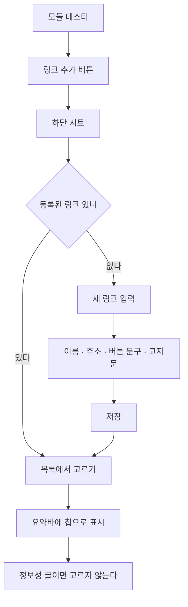
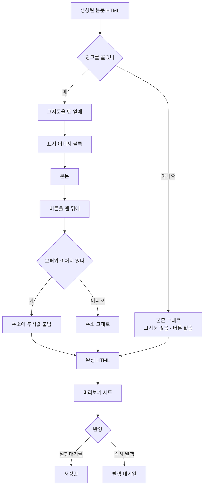

# 홍보 링크와 글 조립

수작업으로 하던 "고지문 얹고 버튼 붙이기"를 모듈 테스터가 대신한다.

## 왜 별도 목록인가

CPA 오퍼는 광고 심의 규칙을 관리하는 무거운 체계다(규칙 추출·충돌
검토·사람 확인). 버튼에 넣을 주소 하나 쓰려고 그 절차를 매번 밟을
이유가 없다. **주소·버튼 문구·고지문만 담는 가벼운 목록**을 따로 둔다.

오퍼와 이어붙일 수도 있다(선택). 이으면 어느 글에서 눌렸는지 추적된다.

## 등록



## 조립

미리보기와 저장이 **같은 결과**를 쓰도록, 조립은 서버에서 한 번만 한다.
화면에서 따로 만들면 보이는 것과 올라가는 것이 갈린다.



## 완성 모양

```
<p style="font-size:15px;color:#8a8a8a;">이 포스팅은 애드릭스 …</p>
<div class="separator" …></div>
… 본문 …
<div class="button-link"><a href="…" rel="nofollow sponsored">이사 견적 …</a></div>
```

고지문은 **맨 앞**이다. 2024-12-01 개정으로 끝부분 게재가 막혔다.

버튼은 `div` 로 감싼다. `button-link` 는 블록 스타일이라 `a` 만 두면
줄 안에 갇힌다.

## 정보성 글

링크를 고르지 않으면 고지문·버튼이 **둘 다** 빠진다. 하나만 빠지는
경우는 없다 — 고지문은 링크가 있을 때만 필요하고, 링크가 있는데
고지문이 없으면 표시 위반이다.
