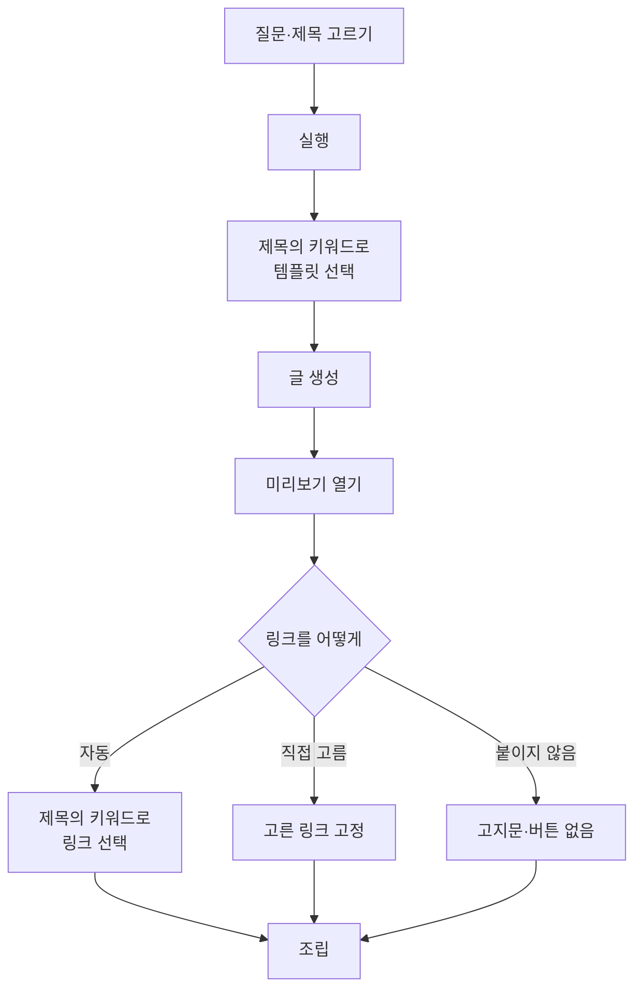
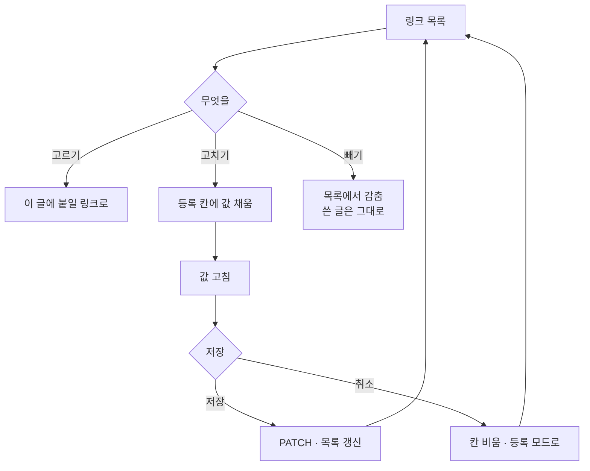

# 키워드로 링크를 고른다

## 지금 무엇이 빠져 있나

프롬프트 템플릿은 제목의 키워드로 **저절로** 갈린다(로테이션). 그런데
링크는 **사람이 고른 하나가 모든 글에 그대로** 붙는다.

이사 견적 글과 청소 글을 한 회차에 만들면 둘 다 같은 링크를 단다.

## 맞추는 방식은 이미 있다

프롬프트 로테이션의 키워드 조합을 그대로 쓴다.

    이사+견적  →  다이사 이사 가격비교
    이사+청소  →  이사/입주 청소 모두클린

`+` 로 묶은 낱말이 **모두** 제목에 있어야 걸린다. 여럿이 맞으면 더
구체적인 쪽이 이긴다. 템플릿과 같은 규칙이라 따로 배울 것이 없다.

## 흐름

**템플릿과 링크가 같은 키워드를 본다.** 이사 견적 글에는 견적 링크가,
청소 글에는 청소 링크가 붙는다.

## 맞는 링크가 없으면

붙이지 않는다. 엉뚱한 링크를 다느니 없는 편이 낫다 — 정보성 글로
나간다. 화면에 그렇게 적는다.

## 블로그 전용

링크에 블로그를 박아 두면 **그 블로그를 담았을 때만** 목록에 보인다.
비워 두면 어느 블로그에서나 쓴다. 이사 링크가 요리 블로그 목록에
섞이지 않게 하는 장치다.

## 고친다

주소가 바뀌거나 키워드를 잘못 적었을 때, 지금은 지우고 새로 등록하는
길밖에 없었다. 지우면 그 링크로 나간 글과의 연결도 흐려진다.

목록의 링크마다 **고치기**를 둔다. 누르면 아래 등록 칸이 그 링크의 값
으로 채워지고, 등록 버튼이 **고치기 저장**으로 바뀐다. 칸을 새로 만들지
않는다 — 등록과 수정이 같은 칸을 쓰면 배울 것이 하나다.

**고르고 있던 링크를 고치면** 고른 상태도 새 값으로 따라간다. 버튼 문구를
고쳤는데 미리보기는 옛 문구인 채면 무엇이 맞는지 알 수 없다.

키워드를 지우면(빈 칸) 그 링크는 **자동 선택에서 빠진다.** 등록할 때와
같은 규칙이다.
