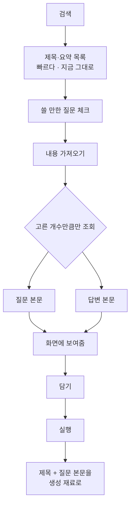

# 고른 질문의 본문을 글 재료로

## 왜

검색 API 는 **요약 130자**만 준다. 질문과 답변이 뒤섞여 잘린 형태다.
손으로 글을 쓸 때 질문에서 얻는 것은 **상황**인데(품목·지역·날짜·층수)
요약에서는 그게 잘려 나간다.

질문 페이지를 열면 질문 본문과 답변이 따로 뽑힌다(실측: 질문 113~346자,
답변 581~704자).

## 전부 긁지 않는다

한 페이지가 34만 자다. 목록 20건을 띄울 때마다 전부 긁으면 요청 20번에
7MB 를 받는다. 화면이 멈추고 차단 위험도 생긴다.

**고른 것만 가져온다.**



## 재료로 넘어가는 모양

제목만 넘기던 자리에 **질문 본문과 답변을 함께** 넘긴다. 제목마다 다른
질문이 붙으므로 **제목과 짝을 맞춰** 전달한다.

```
[이 글을 쓰게 된 질문]
질문: (질문자가 쓴 본문 그대로)
사람들이 단 답: (답변 요약)

→ 위 상황에 답하는 글을 씁니다.
  질문에 있는 조건(지역·품목·날짜)을 글에 살립니다.
```

**답변은 참고용이다.** 그대로 옮기면 남의 글이 된다. 프롬프트에 그
선을 적어 둔다.

## 실패해도 막지 않는다

본문 조회가 실패하면 **제목만으로 간다.** 지금과 같아질 뿐 글이
안 나오는 일은 없다.
