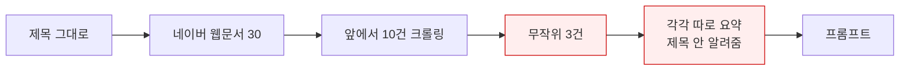
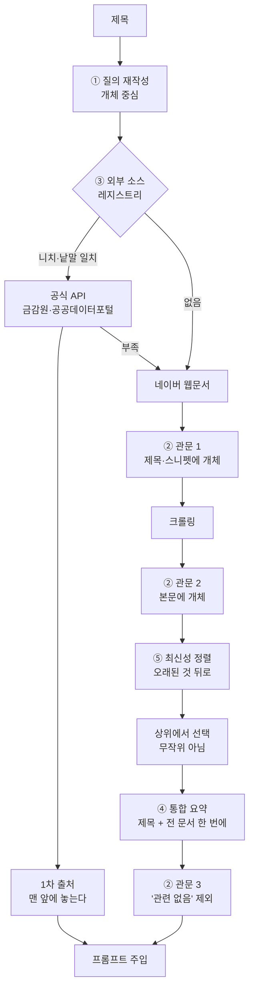
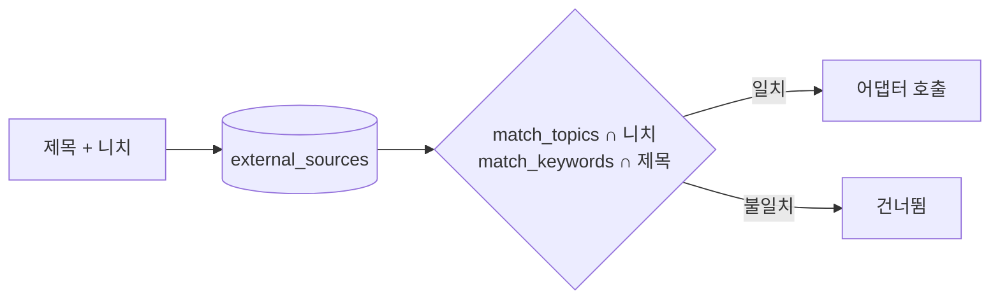

# 참조자료 정확도 — 검색부터 주입까지

머니조아 실측(2026-09-06): 제목 "우리은행 우리아파트론 대출 금리와 방식" 으로
모은 자료 3건이 **신용대출 일반 · 주담대 일반 · 우리은행 대표전화 안내** 였다.
세 건 다 그 상품이 아니다. 관련성을 판단하는 지점이 한 곳도 없었다.

## 지금 (문제)

## 고친 뒤

## 왜 이 순서인가

**①②를 먼저** — 크기가 작고, 이번 실패(전화번호 페이지)는 관문 1에서 걸린다.
API 없이도 즉시 나아진다.

**③은 3a(틀)부터** — 3c(금감원)를 먼저 만들면 그게 곧 개별 연동이 되고,
나중에 레지스트리로 옮기는 일이 두 번 된다.

## 1차 출처를 못 찾으면

**억지로 비슷한 것을 붙이지 않는다.** 조용히 웹문서로 간다.
주담대 일반론이 "우리아파트론의 조건" 인 것처럼 들어간 것이 이번 사고다.

## 자동 선택 — 코드가 아니라 데이터로

새 API 는 화면에서 등록한다. 공공데이터포털은 인증·응답이 표준이라
**어댑터 하나로 여러 API** 를 받는다. 금감원처럼 자체 규격은 어댑터가 따로 필요하다.
