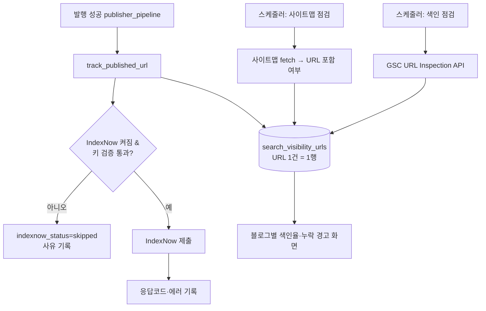
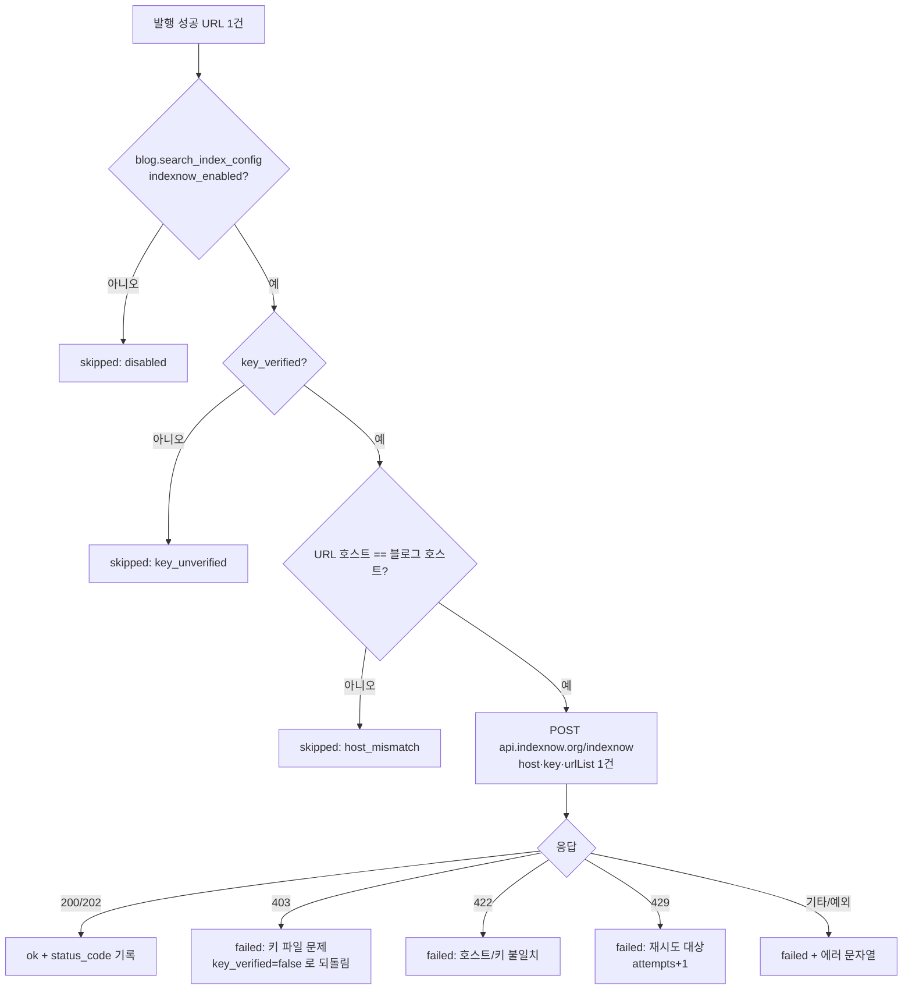
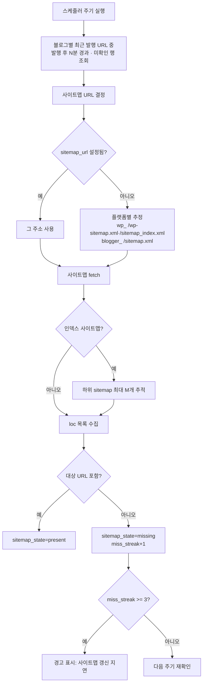
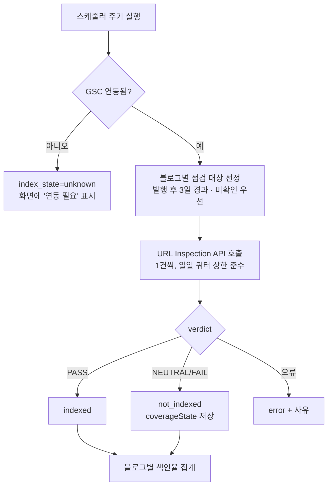

# 검색 노출 3종 — S6 색인 점검 · S1 IndexNow · S2 사이트맵 신선도

> 근거: `docs/plans/search_visibility_plan.md` §4.1, `docs/plans/adsense_status_automation_plan.md` §5.3·§6(6→7→8).
> 사용자 지시(2026-08-25): 노출 3종 우선 착수.

## 원칙

- **측정이 먼저**: 계획서가 정한 순서는 S6 → S1 → S2다. 세 기능을 함께 배포하되
  **IndexNow 기본값을 OFF**로 두어, 색인율 기준선을 먼저 잡은 뒤 켤 수 있게 한다.
  (이전 운영에서 "효과가 없어 보여 제거"한 판단을 반복하지 않기 위함)
- **조용한 실패 금지**: 모든 제출·점검 결과는 응답코드까지 DB에 남긴다.
- **발행을 막지 않는다**: 노출 관련 처리는 전부 발행 성공 **이후** 부가 작업이며,
  실패해도 발행 결과를 바꾸지 않는다.
- **단일 원장**: URL 하나당 한 행(`search_visibility_urls`)에 S1·S2·S6 상태를 모두 기록한다.

## ⚠️ IndexNow 키 파일 제약 (설계 결정의 핵심)

IndexNow 공식 문서 확인 결과:

- 키 파일은 **호스트 루트**에 `{key}.txt`로 있어야 한다.
- `keyLocation`으로 하위 경로를 지정할 수는 있으나, **그 경로 하위 URL만 제출 가능**하다.
  (`/catalog/key.txt` → `/catalog/` 하위만 제출 가능, `/help/`는 불가)

따라서:

| 플랫폼 | 가능 여부 | 이유 |
|---|---|---|
| 워드프레스 | **조건부** — 사용자가 루트에 키 파일을 1회 업로드해야 함 | REST API로는 루트에 파일을 만들 수 없음. `wp-content/uploads`에 올려도 keyLocation 제약으로 무용 |
| 블로거 | **불가** | 루트에 임의 파일을 서빙할 수 없음 |

→ blogauto는 **키를 발급·표시하고, 업로드 여부를 자동 검증**한 뒤 검증을 통과한 블로그만
제출한다. 검증 실패 상태에서는 제출을 시도하지 않는다(403 반복 방지).
**이것이 과거 IndexNow가 조용히 실패하다 제거된 원인일 가능성이 높다.**

---

## 전체 구조



---

## S1 — IndexNow

### 키 준비 흐름

```mermaid
flowchart TD
    A[블로그 설정에서 IndexNow 켜기] --> B{플랫폼}
    B -->|blogger| X[지원 불가 안내 후 비활성 고정]
    B -->|wordpress| C{키 있음?}
    C -->|없음| D[32자 키 자동 발급 후 저장]
    C -->|있음| E
    D --> E[사용자에게 안내:<br/>https_//host/{key}.txt 에<br/>내용이 key 인 파일 업로드]
    E --> F[검증 버튼 → GET {key}.txt]
    F --> G{본문 == key?}
    G -->|예| H[key_verified=true<br/>제출 활성화]
    G -->|아니오| I[key_verified=false<br/>사유 표시, 제출 안 함]
```

### 제출 흐름



- **재발행**: 내용이 실제로 바뀐 경우에만 재제출(`content_hash` 변경 시).
- **재시도**: 429/네트워크 오류만 대상. 최대 3회, 스케줄러가 처리.

---

## S2 — 사이트맵 신선도



- 실측 근거: `doooit082.com` 사이트맵이 8/20에서 멈춰 8/22 발행분이 누락돼 있었다.
- **lastmod**도 함께 읽어 사이트맵 자체의 정체 여부를 판단한다.

---

## S6 — 색인 상태 점검



- **구글 Indexing API는 사용하지 않는다**(JobPosting/BroadcastEvent 한정, 일반 글은 정책 위반).
- GSC는 **속성 소유 확인**이 전제다. 미연동/미확인이면 조용히 넘어가지 않고 화면에 사유를 띄운다.
- 쿼터: URL Inspection은 속성당 일일 2,000건 제한 → 블로그별 1일 상한을 설정으로 둔다.

---

## 데이터

### `search_visibility_urls` (신규 테이블)

| 컬럼 | 용도 |
|---|---|
| `blog_id`, `crawled_post_id`, `url`, `title`, `published_at` | 대상 식별 |
| `indexnow_status` `pending/ok/failed/skipped` · `indexnow_status_code` · `indexnow_error` · `indexnow_attempts` · `indexnow_submitted_at` | S1 |
| `sitemap_state` `unknown/present/missing` · `sitemap_checked_at` · `sitemap_miss_streak` | S2 |
| `index_state` `unknown/indexed/not_indexed/error` · `index_checked_at` · `index_detail`(JSON) | S6 |

- `(blog_id, url)` 유니크 → 재발행 시 같은 행 갱신(멱등).

### `blogs.search_index_config` (신규 JSON 컬럼)

```json
{
  "indexnow_enabled": false,
  "indexnow_key": "…32자…",
  "indexnow_key_verified": false,
  "indexnow_key_checked_at": "…",
  "sitemap_check_enabled": true,
  "sitemap_url": null,
  "index_check_enabled": true,
  "index_check_daily_cap": 20
}
```

`indexnow_enabled` 기본값 **false** — 색인율 기준선 확보 후 사용자가 켠다.

---

## 실패 처리 원칙

| 상황 | 처리 |
|---|---|
| IndexNow 403 | 키 검증 상태를 false로 되돌리고 **제출 중단**. 화면에 재업로드 안내 |
| 사이트맵 fetch 실패 | `sitemap_state` 유지, 에러 로그. 연속 실패 시 경고 |
| GSC 미연동 | 점검 스킵, 화면에 "연동 필요". 조용한 성공으로 위장하지 않음 |
| 발행 훅 내 예외 | 전부 삼키고 로그만 — **발행 결과에 영향 없음** |
