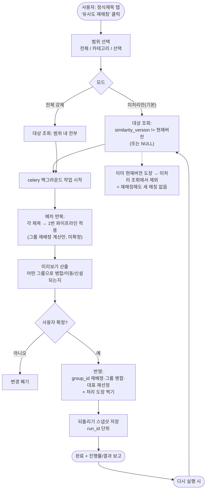
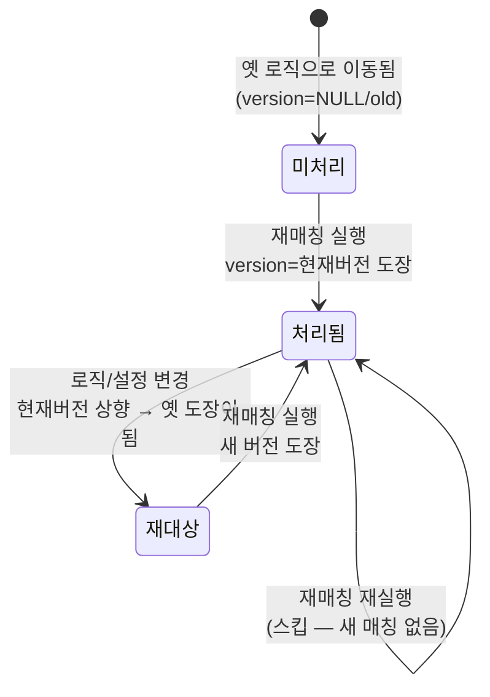

# 유사도 매칭 개편 V4 — 순서도

> 관련 설계서: `docs/plans/similarity_matching_v4_plan.md`
> 작성일: 2026-07-25 | 상태: 설계(미구현)

임베딩 없이 기존 구조를 확장한다. 핵심 4축: **(A) 설정 통일, (B) 회색지대 AI,
(C) 키워드 블로킹, (E) 수동 재매칭 + 멱등성**.

---

## 1. 그룹핑 파이프라인 (승격/데이터모듈/재매칭 공통)

```mermaid
flowchart TD
    START([대상 제목 1건 T]) --> KW["C. 키워드 블로킹<br/>T의 의미토큰 추출<br/>→ 같은 토큰 가진 후보만 조회"]
    KW --> HASC{후보 존재?}
    HASC -- 아니오 --> NEWG[새 그룹 생성<br/>T=대표]
    HASC -- 예 --> SCORE["유사도 점수 계산<br/>calculate_similarity_v3<br/>(후보 전부와, 대표만 아님)"]
    SCORE --> BEST[최고점 후보 C*, 점수 S]
    BEST --> BAND{"B. 밴드 판정<br/>(상한=임계값 T, 하한 L)"}
    BAND -- "S >= T(임계값)" --> GROUP[C*의 그룹에 합류]
    BAND -- "S <= L(하한)" --> NEWG
    BAND -- "L < S < T (회색지대)" --> CACHE{AI 판정 캐시<br/>(T,C*) 존재?}
    CACHE -- 예 --> USECACHE[캐시 결과 사용]
    CACHE -- 아니오 --> AI["저렴 AI 질의<br/>'같은 주제인가?'"]
    AI --> STOREC[판정 캐시에 저장]
    STOREC --> DECI{같은 주제?}
    USECACHE --> DECI
    DECI -- 예 --> GROUP
    DECI -- 아니오 --> NEWG
    GROUP --> STAMP["A/E. 처리 도장<br/>similarity_version=현재버전<br/>similarity_matched_at=now<br/>similarity_score=S"]
    NEWG --> STAMP
    STAMP --> END([완료])
```

---

## 2. 수동 재매칭 흐름 (정식제목 탭) — 멱등성



---

## 3. 멱등성 상태 전이 (버전 도장)


