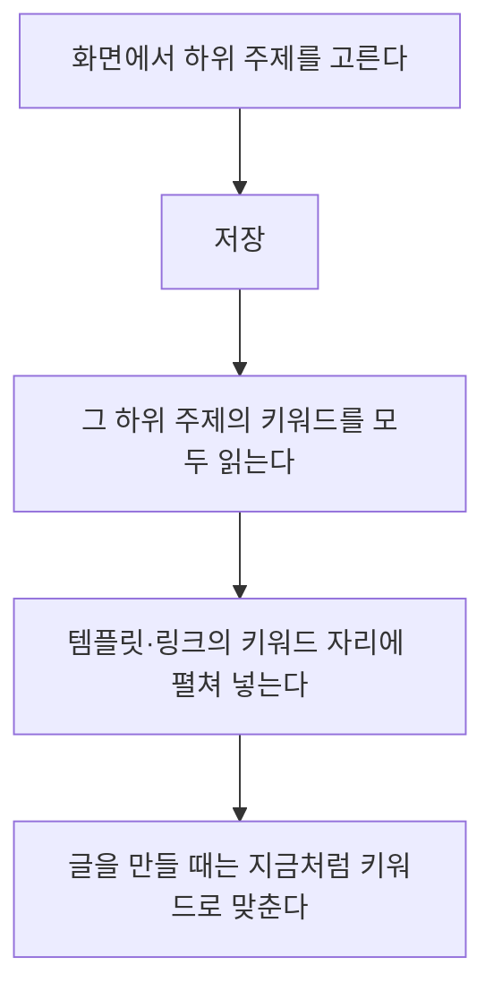

# 키워드를 손으로 적지 않고 하위 주제로 잇는다

## 지금 무엇이 번거로운가

프롬프트 템플릿과 홍보 링크는 **키워드 조합을 손으로 적어** 연결한다.

    이사+견적, 이사+비용, 이사+가격

카테고리에는 이미 하위 주제마다 키워드가 등록돼 있는데, 같은 말을 또 적는
셈이다. 카테고리에 키워드를 더해도 모듈·링크는 모른다.

## 하위 주제를 고르면 그 키워드가 따라온다

**펼쳐서 저장하는 이유**는 글을 만들 때마다 카테고리를 다시 읽지 않기
위해서다. 고르는 일은 가끔이고 글은 매일 나간다.

## 손으로 적은 키워드도 그대로 둔다

하위 주제를 고르지 않으면 지금처럼 적은 키워드가 쓰인다. 둘을 함께 쓰면
**합쳐서** 맞춘다 — 하위 주제로 큰 그물을 치고, 손으로 적은 것으로 빠진
말을 보탠다.

## 카테고리에 키워드를 더했다면

모듈이나 링크를 **다시 저장**하면 최신 키워드로 다시 펼친다. 화면에
「하위 주제 2개 · 키워드 14개 연동」처럼 몇 개가 딸려 왔는지 적어,
다시 저장할 때가 됐는지 알 수 있게 한다.
