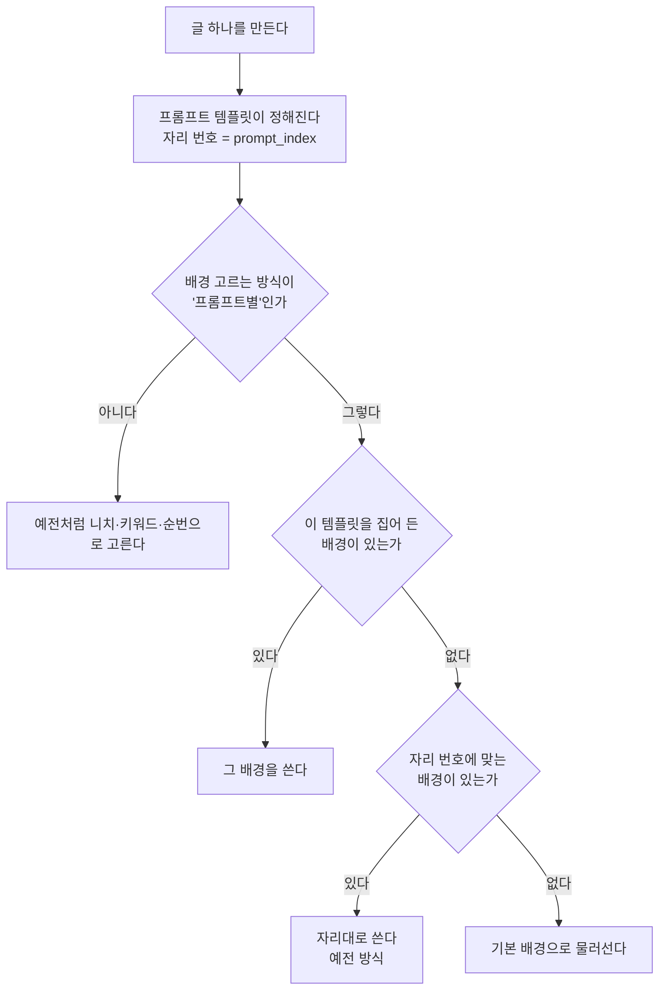

# 배경을 프롬프트 템플릿으로 고르기

## 왜

배경을 "프롬프트별"로 쓰면 **자리 순서**로만 짝이 정해졌다.

    기본 배경 → 템플릿 1
    추가 1번  → 템플릿 2
    추가 2번  → 템플릿 3

자리로만 정하면 두 가지가 불편하다.

* 템플릿 순서를 바꾸거나 하나 지우면 배경이 통째로 밀린다.
* 화면에는 어느 배경이 어느 템플릿 것인지 **아무 표시가 없다**. 주제 ID
  칸이 있지만 그건 "니치별" 모드용이고, 사용자가 번호를 외워 적어야 한다.

그래서 슬롯마다 **프롬프트 템플릿을 골라 두는 칸**을 만든다. 고른 것이
있으면 자리와 무관하게 그 템플릿에서 쓰인다.

## 고르는 차례

**집어 든 배경이 먼저다.** 아무도 안 집었으면 예전처럼 자리대로 간다 —
이미 자리로 맞춰 둔 블로그를 건드리지 않기 위해서다.

## 저장 모양

`overlay_config` 안에 둔다.

    template_image_prompt        기본 배경(슬롯 0)이 맡은 템플릿 자리
    template_images[].prompt_index   추가 배경이 맡은 템플릿 자리

둘 다 **0부터** 센다(0 = 템플릿 1). 비워 두면 안 고른 것이다.

## 화면

이미지 탭의 배경 칸마다 드롭다운을 둔다. 목록은 그 블로그에 걸린
**생성 프롬프트 모듈의 템플릿**을 그대로 보여 준다.

    템플릿 1 (기본) · 📈 주식·ETF
    템플릿 2 · 🏛 정부 정책·지원금
    ...

목록은 `GET /api/v1/blogs/{blog_id}/prompt-templates` 로 받는다. 블로그에
걸린 프롬프트 모듈(`settings.blogs` 에 이 블로그가 든 것)을 찾아
`prompt_rotation.variants` 를 자리 순서대로 돌려준다.

로테이션을 쓰지 않는 블로그면 빈 목록이 오고, 화면은 드롭다운을 숨긴다.

## 곁들여 고친 것 — 미리보기가 옛 그림을 보여 주던 문제

추가 배경 미리보기 주소가 `?t=0` 으로 굳어 있었다. 파일 이름이 같고
내용만 바뀌면 브라우저가 예전 그림을 계속 썼다. 설정을 불러올 때마다
`t` 를 새로 매긴다.
