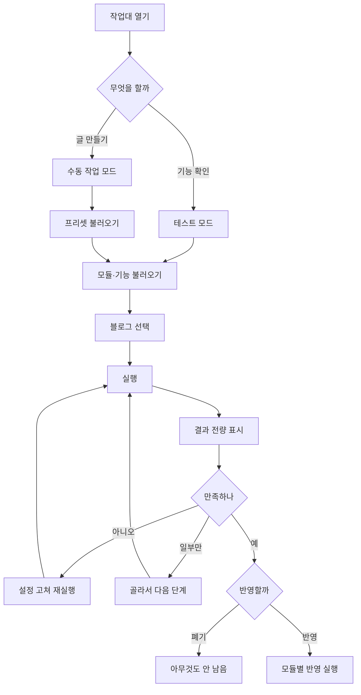
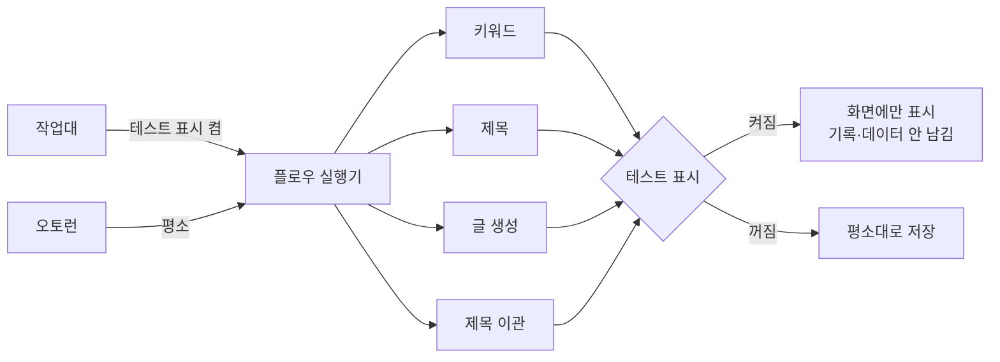
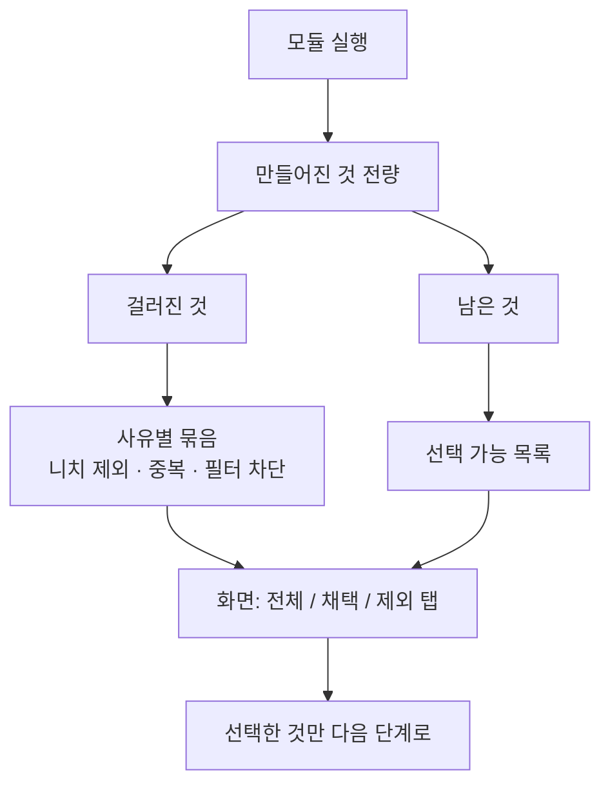
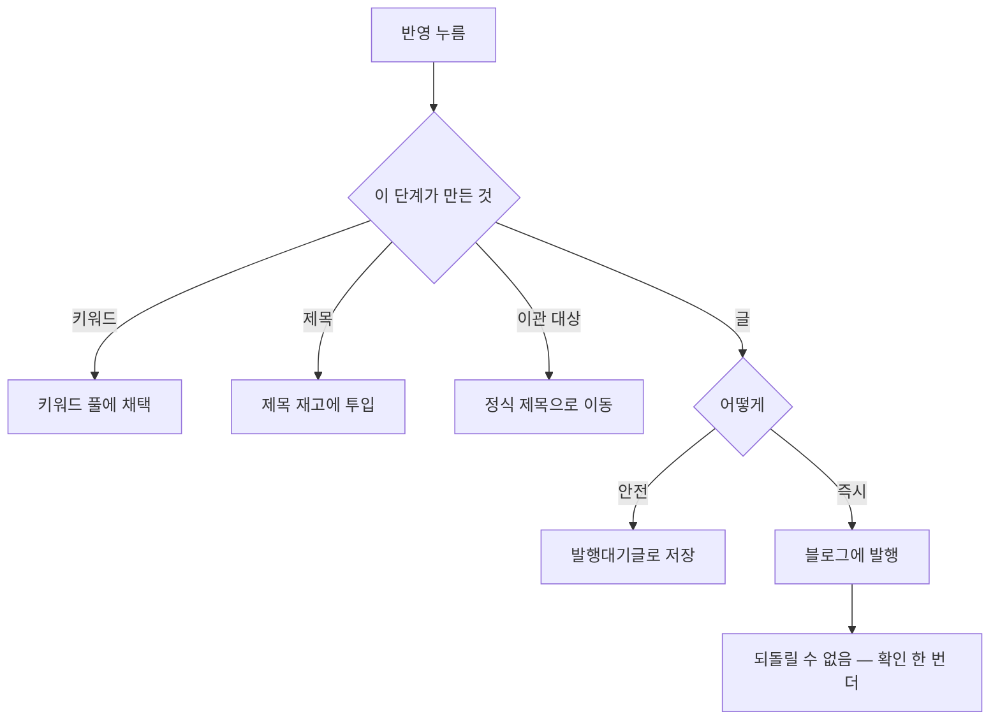

# 통합 테스터(작업대) 순서도

> 계획서: `docs/plans/test_workbench_plan.md`

## 1. 전체 흐름

```mermaid
flowchart TD
    A[작업대 열기] --> B{무엇을 할까}
    B -->|기능 확인| C[테스트 모드]
    B -->|글 만들기| D[수동 작업 모드]

    C --> E[모듈·기능 불러오기]
    D --> P[프리셋 불러오기]
    P --> E

    E --> F[블로그 선택]
    F --> G[실행]

    G --> H[결과 전량 표시]
    H --> I{만족하나}
    I -->|아니오| J[설정 고쳐 재실행]
    J --> G
    I -->|일부만| K[골라서 다음 단계]
    K --> G
    I -->|예| L{반영할까}

    L -->|폐기| M[아무것도 안 남음]
    L -->|반영| N[모듈별 반영 실행]
```

## 2. 실행 경로 — 실제 발행과 같은 길

```mermaid
flowchart LR
    W[작업대] -->|테스트 표시 켬| S[플로우 실행기]
    O[오토런] -->|평소| S

    S --> M1[키워드]
    S --> M2[제목]
    S --> M3[글 생성]
    S --> M4[제목 이관]

    M1 & M2 & M3 & M4 --> R{테스트 표시}
    R -->|켜짐| V[화면에만 표시<br/>기록·데이터 안 남김]
    R -->|꺼짐| Z[평소대로 저장]
```

## 3. 결과 표시 규격

```mermaid
flowchart TD
    X[모듈 실행] --> Y[만들어진 것 전량]
    Y --> F1[걸러진 것]
    Y --> F2[남은 것]

    F1 --> R1[사유별 묶음<br/>니치 제외 · 중복 · 필터 차단]
    F2 --> R2[선택 가능 목록]

    R1 --> D[화면: 전체 / 채택 / 제외 탭]
    R2 --> D
    D --> N[선택한 것만 다음 단계로]
```

## 4. 반영 분기

```mermaid
flowchart TD
    A[반영 누름] --> B{이 단계가 만든 것}
    B -->|키워드| C[키워드 풀에 채택]
    B -->|제목| D[제목 재고에 투입]
    B -->|이관 대상| E[정식 제목으로 이동]
    B -->|글| F{어떻게}
    F -->|안전| G[발행대기글로 저장]
    F -->|즉시| H[블로그에 발행]
    H --> I[되돌릴 수 없음 — 확인 한 번 더]
```
