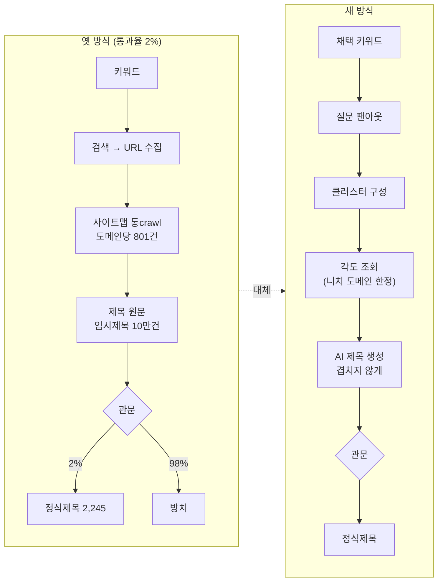
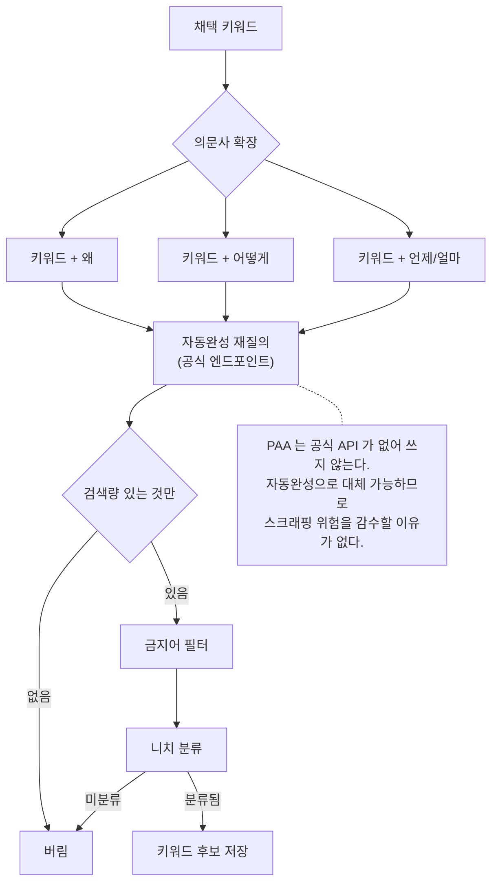
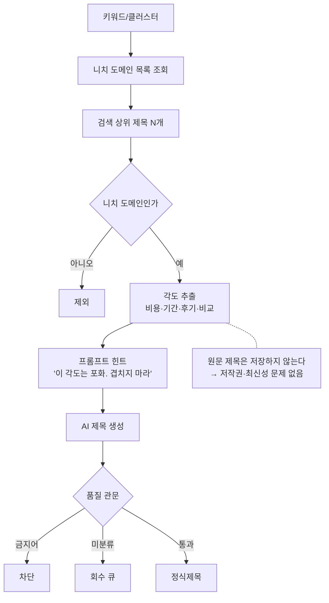
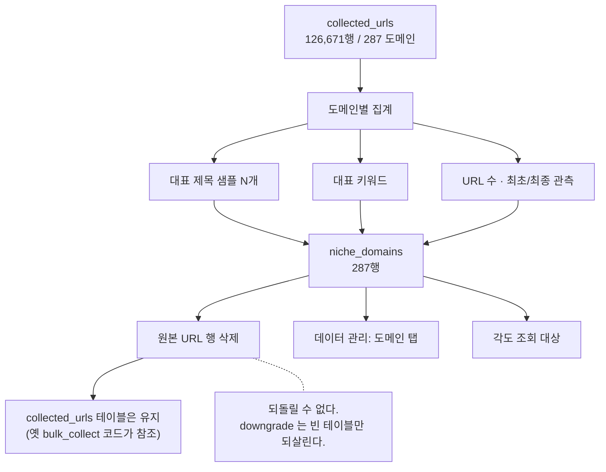

# 제목 생성/수집 파이프라인 순서도

> 계획서: `docs/plans/title_pipeline_redesign_plan.md`

## 1. 전체 흐름 — 옛 방식과의 대비

```mermaid
flowchart LR
    subgraph OLD["옛 방식 (통과율 2%)"]
        direction TB
        O1[키워드] --> O2[검색 → URL 수집]
        O2 --> O3["사이트맵 통crawl<br/>도메인당 801건"]
        O3 --> O4["제목 원문<br/>임시제목 10만건"]
        O4 --> O5{관문}
        O5 -->|2%| O6[정식제목 2,245]
        O5 -->|98%| O7[방치]
    end

    subgraph NEW["새 방식"]
        direction TB
        N1[채택 키워드] --> N2[질문 팬아웃]
        N2 --> N3[클러스터 구성]
        N3 --> N4["각도 조회<br/>(니치 도메인 한정)"]
        N4 --> N5["AI 제목 생성<br/>겹치지 않게"]
        N5 --> N6{관문}
        N6 --> N7[정식제목]
    end

    OLD -.대체.-> NEW
```

## 2. 질문 팬아웃 (T2)

```mermaid
flowchart TD
    A[채택 키워드] --> B{의문사 확장}
    B --> B1["키워드 + 왜"]
    B --> B2["키워드 + 어떻게"]
    B --> B3["키워드 + 언제/얼마"]
    B1 & B2 & B3 --> C["자동완성 재질의<br/>(공식 엔드포인트)"]
    C --> D{검색량 있는 것만}
    D -->|없음| X[버림]
    D -->|있음| E[금지어 필터]
    E --> F[니치 분류]
    F -->|미분류| X
    F -->|분류됨| G[키워드 후보 저장]

    note["PAA 는 공식 API 가 없어 쓰지 않는다.<br/>자동완성으로 대체 가능하므로<br/>스크래핑 위험을 감수할 이유가 없다."]
    C -.- note
```

## 3. 각도 신호 (T3) — 원문을 재고로 쓰지 않는다

```mermaid
flowchart TD
    A[키워드/클러스터] --> B[니치 도메인 목록 조회]
    B --> C[검색 상위 제목 N개]
    C --> D{니치 도메인인가}
    D -->|아니오| X[제외]
    D -->|예| E[각도 추출<br/>비용·기간·후기·비교]
    E --> F["프롬프트 힌트<br/>'이 각도는 포화. 겹치지 마라'"]
    F --> G[AI 제목 생성]
    G --> H{품질 관문}
    H -->|금지어| X2[차단]
    H -->|미분류| Q[회수 큐]
    H -->|통과| I[정식제목]

    note["원문 제목은 저장하지 않는다<br/>→ 저작권·최신성 문제 없음"]
    E -.- note
```

## 4. 도메인 자산 전환 (T1)

```mermaid
flowchart TD
    A["collected_urls<br/>126,671행 / 287 도메인"] --> B[도메인별 집계]
    B --> C["대표 제목 샘플 N개"]
    B --> D["대표 키워드"]
    B --> E["URL 수 · 최초/최종 관측"]
    C & D & E --> F["niche_domains<br/>287행"]
    F --> G[원본 URL 행 삭제]
    G --> H["collected_urls 테이블은 유지<br/>(옛 bulk_collect 코드가 참조)"]

    F --> I[데이터 관리: 도메인 탭]
    F --> J[각도 조회 대상]

    warn["되돌릴 수 없다.<br/>downgrade 는 빈 테이블만 되살린다."]
    G -.- warn
```
