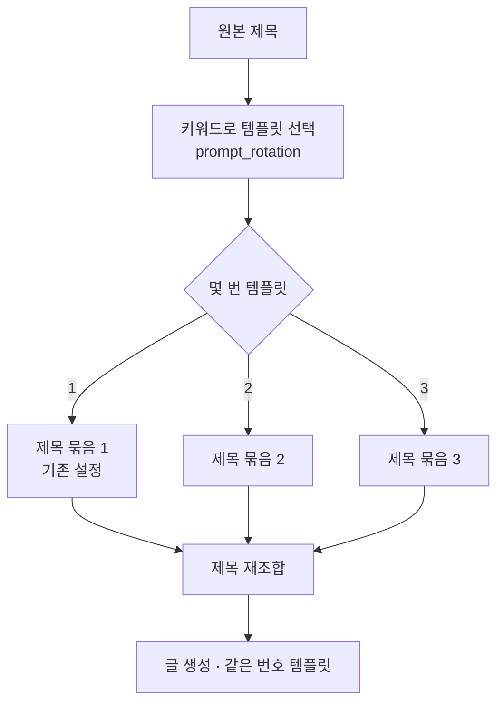
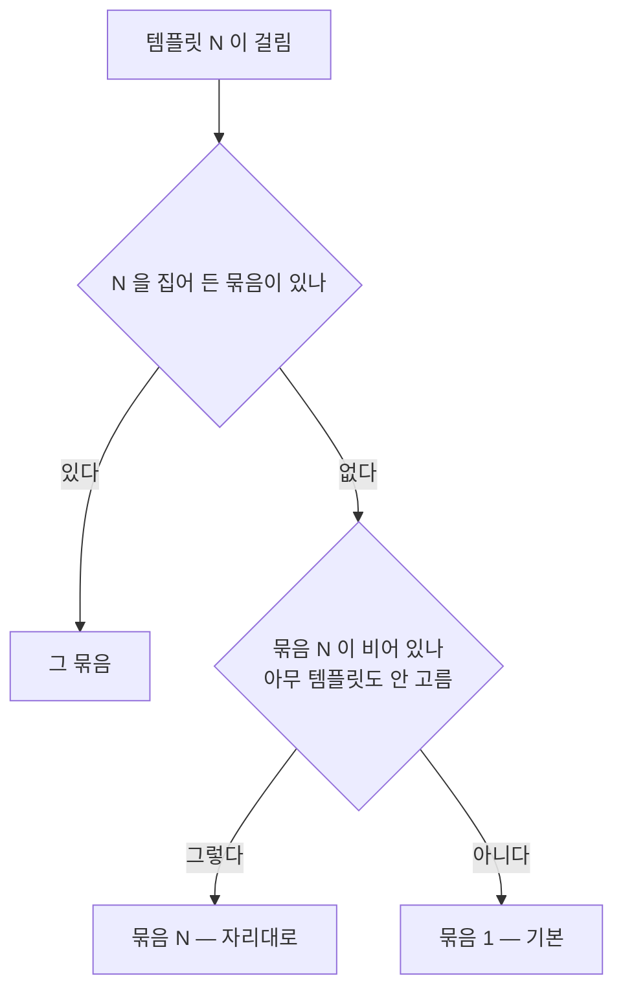

# 제목 묶음도 템플릿을 따라간다

## 지금 어긋나 있는 것

프롬프트 템플릿은 제목의 키워드로 갈린다. 「이사+견적」이면 템플릿 1,
「이사+청소」면 템플릿 2 가 쓰인다. 그런데 **제목 재조합 설정은 하나뿐**
이라, 어느 템플릿이 걸리든 같은 제목 스타일·같은 길이·같은 지시로
제목이 만들어진다.

견적 글과 청소 글은 글의 뼈대가 다른데 제목만 같은 틀에서 나온다.

## 묶음으로 갈린다

제목 재조합도 **템플릿과 같은 번호의 묶음**을 쓴다. 한 묶음은 넷이다.

    제목 스타일 선택 · 제목 길이 · 스타일별 지시 · 추가 지시사항

묶음 1 은 지금 있는 설정 그대로다(템플릿 1 = 기본). 묶음 2 부터 추가한다.

**순서가 뒤집히지 않는다.** 템플릿은 *원본* 제목의 키워드로 고르고,
그 결정이 제목 재조합보다 먼저 난다. 재조합된 제목으로 다시 고르지
않으므로 제목과 본문이 서로 다른 번호를 쓸 일이 없다.

## 짝은 바꿀 수 있다

자리대로만 묶이면 「템플릿 3 에 묶음 2 를 쓰고 싶다」를 못 한다. 묶음마다
**쓸 템플릿을 직접 고른다.**

- **아무것도 고르지 않으면 제자리**다 — 묶음 2 는 템플릿 2 에 쓰인다.
  지금까지 쓰던 모듈은 손대지 않아도 그대로 돌아간다.
- **고르면 그 템플릿에만** 쓰인다. 제자리는 포기한다 — 두 군데서 쓰이면
  어느 쪽이 맞는지 알 수 없다.
- 한 묶음이 **여러 템플릿**을 집어도 된다. 템플릿 2·4 가 같은 제목 틀을
  쓰는 것이 자연스러울 때가 있다.
- 한 템플릿을 여러 묶음이 집으면 **위에 있는 묶음**이 이긴다.

## 묶음이 없으면

템플릿 3 이 걸렸는데 묶음 3 이 없으면 **묶음 1** 을 쓴다. 제목이 안
만들어지는 것보다 낫고, 묶음을 다 채우지 않아도 쓸 수 있다.

로테이션이 꺼져 있으면 지금과 똑같다 — 묶음 1 만 쓴다.

## 화면

제목 재조합 설정 안에 프롬프트 로테이션과 **같은 모양**으로 묶음을
쌓는다. 묶음 제목에 어느 템플릿과 짝인지 적는다.

    묶음 1 (기본 · 고른 템플릿이 없는 자리를 맡는다)
    묶음 2   쓸 템플릿: [1] [2]✓ [3]      [삭제]
    묶음 3   쓸 템플릿: 고르지 않음 → 템플릿 3   [삭제]
    + 묶음 추가

템플릿 수보다 묶음이 많으면 남는 묶음은 쓰이지 않는다고 적는다.
