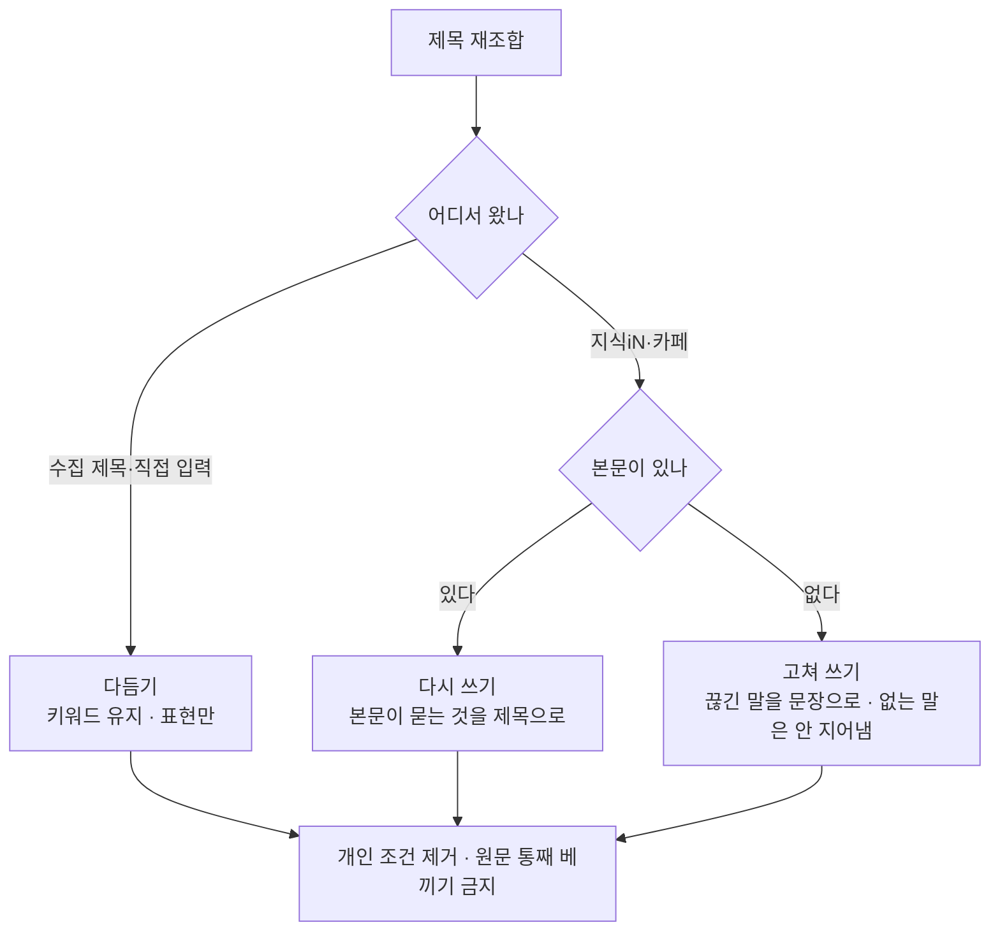

# 어디서 온 제목이냐에 따라 다르게 다듬는다

## 같은 규칙으로는 둘 다 못 한다

    질문 제목: 부동산 과 계약은 끝났는 데 이사 문제 관리 사무소?
    생성 제목: 부동산 계약 끝난 뒤 이사 문제 관리 사무소 먼저 확인할 일

질문 제목은 **사람이 급히 쓴 메모**다. 관리사무소가 왜 나오는지는 본문을
봐야 안다. 그런데 재조합에게 주어진 것은 제목 한 줄뿐이고, 규칙은 "핵심
키워드를 유지하라" 였다. 그래서 맥락 없는 낱말까지 붙들고 가 없는 말을
지어냈다.

반대로 키워드를 풀어 주면 **이미 검색어에 맞춰 수집한 제목**이 망가진다.

## 무엇으로 가르나 — 소스 종류

본문 유무로만 가르면 **카페 비공개 글**이 잘못 분류된다. 본문을 못 가져와도
그것은 여전히 질문 제목이다. 그래서 **소스 종류를 먼저 본다.**

## 세 갈래가 하는 일

**다듬기**(수집 제목) — 지금과 같다. 키워드를 지키고 표현만 손본다.

**다시 쓰기**(질문 + 본문) — 제목이 아니라 **본문이 묻는 것**을 한 줄로
만든다. 원문 제목의 낱말은 지켜야 할 것이 아니라 참고다. 본문에 없는
주장을 제목으로 만들지 않는다.

**고쳐 쓰기**(질문 + 본문 없음) — 본문이 없으니 새 내용을 만들 수 없다.
끊긴 말을 문장으로 잇고, 제목이 말하지 않는 것을 단정하지 않는다.
「관리사무소에 먼저 확인할 일」 처럼 근거 없는 단정을 만들지 않는다.

## 공통 규칙

- **그 사람에게만 해당하는 조건은 뺀다** — 날짜, 동·호수, 특정 단지 이름.
  검색하는 다른 사람에게는 쓸모가 없다.
- **검색되는 조건은 남긴다** — 평수, 원룸·투룸, 이사 거리, 층수 같은 유형.
- 원문 제목의 낱말을 **세 개 이상 잇달아** 그대로 옮기지 않는다.

## 설정을 늘리지 않는다

"재조합 세기" 같은 항목을 두면 글마다 사람이 정해야 한다. 소스가 이미
답을 갖고 있으므로 **자동으로 갈린다.** 새 소스가 생기면 그때 분류에 더한다.
