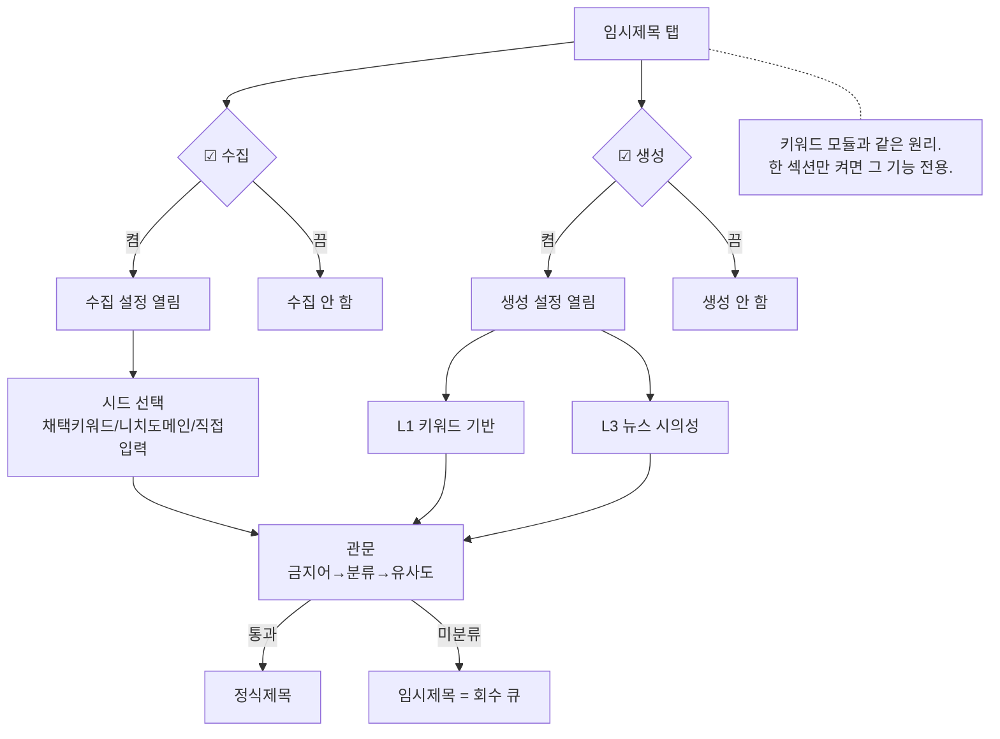
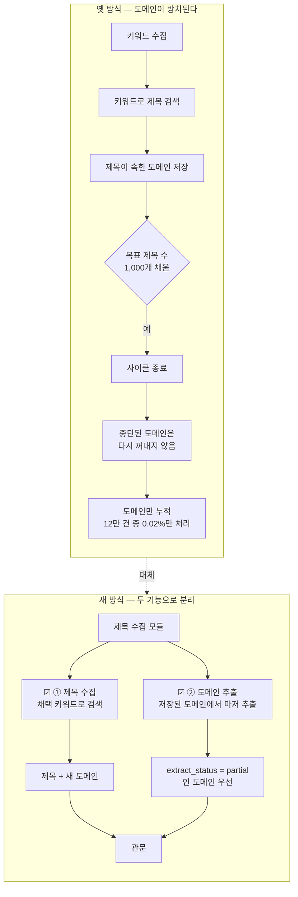
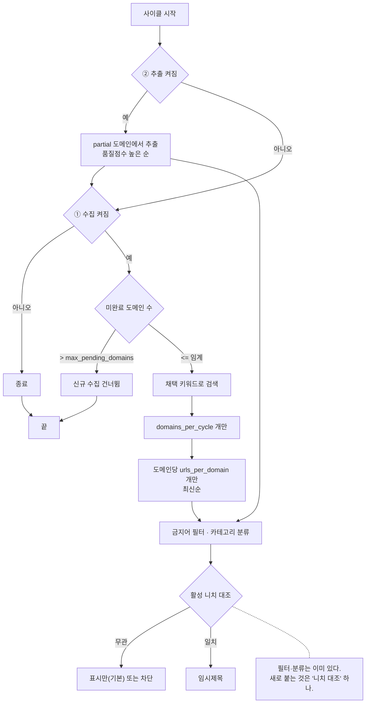
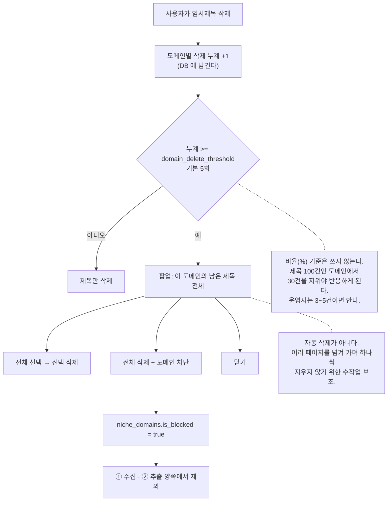
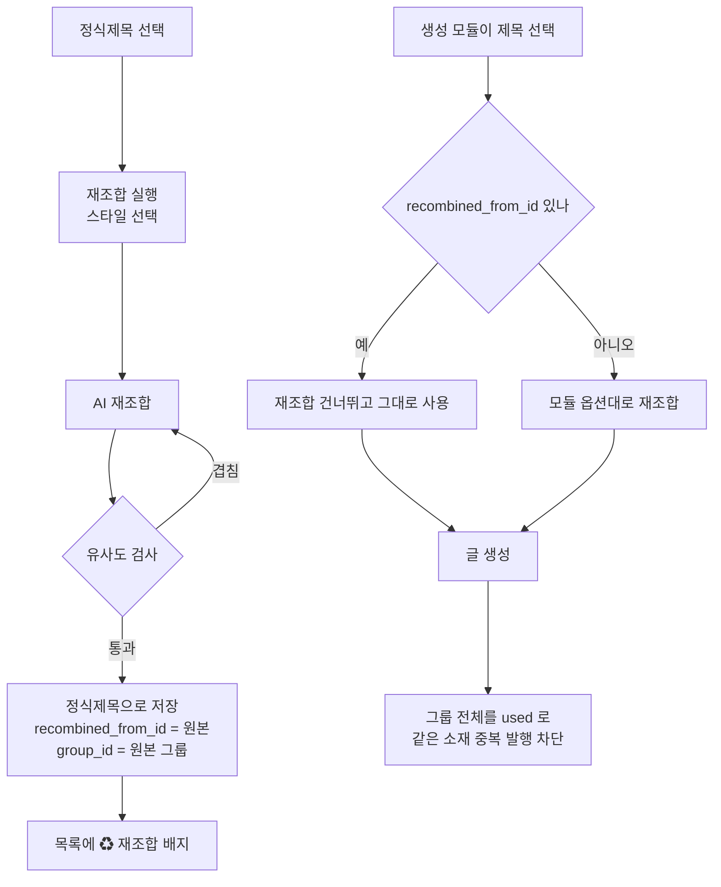
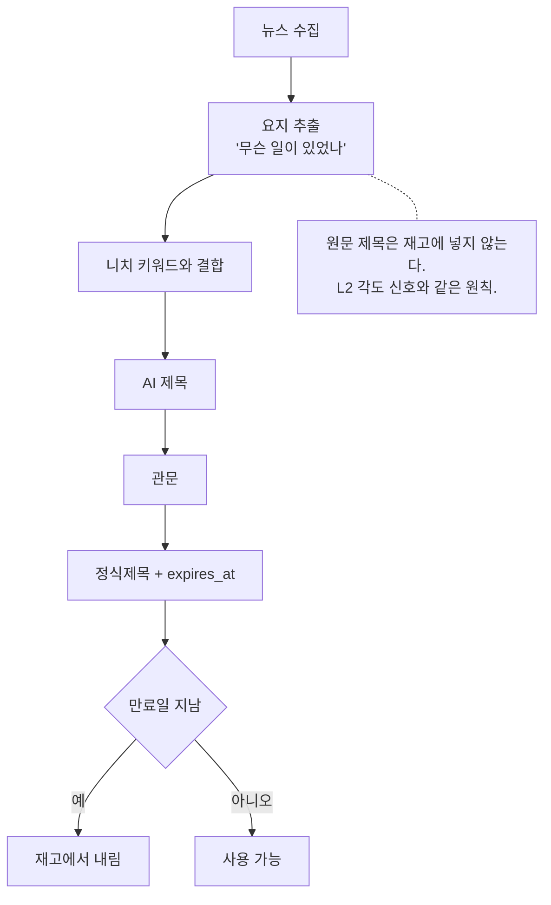
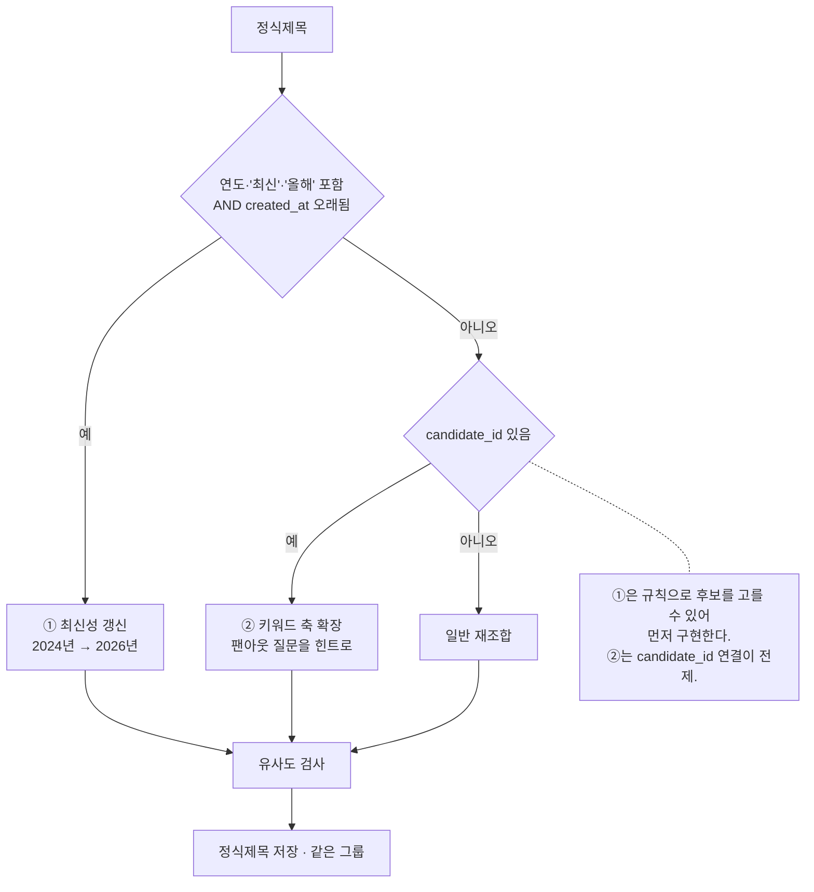
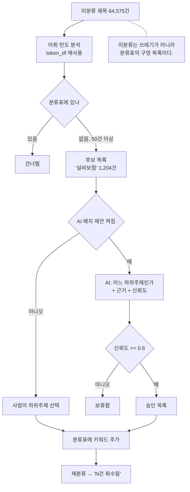
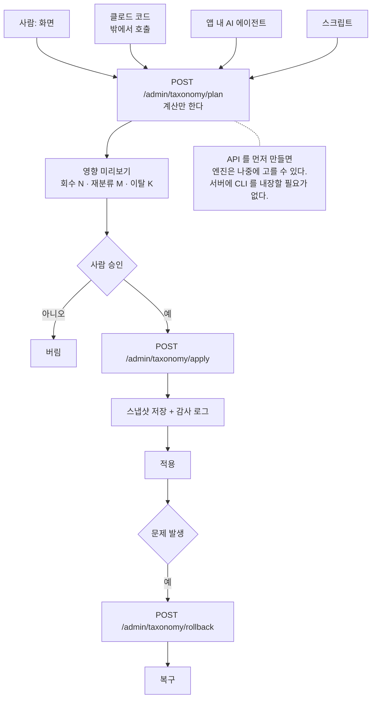

# 임시제목·정식제목 탭 순서도

> 계획서: `docs/plans/title_tab_workplan.md`

## 1. 임시제목 탭 — 섹션 구조

## 2. 수집 — 제목 수집과 도메인 추출을 분리

### 2-1. 한 사이클 안에서의 판단

## 3. 도메인 대량 삭제 → 팝업 → 차단

## 4. 재조합 — 정식제목 탭

## 5. L3 뉴스 시의성

## 6. 확장 재조합 (참고 사항)

## 7. 니치 자동 확장

## 8. 분류표 변경 경로 — 누가 부르든 같은 통로

