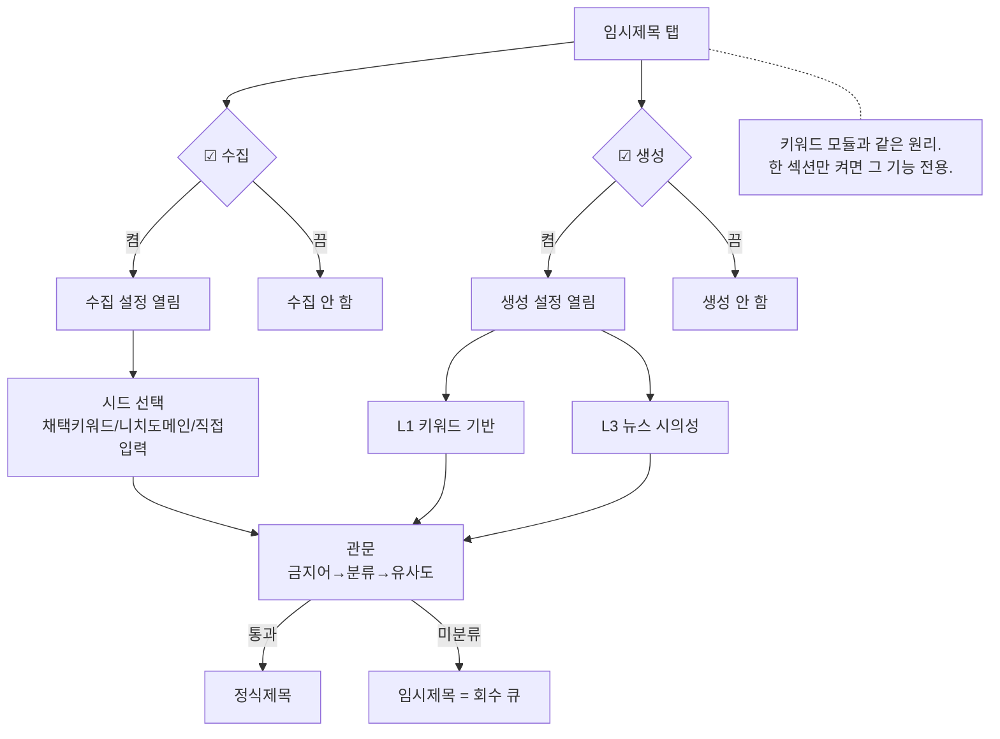
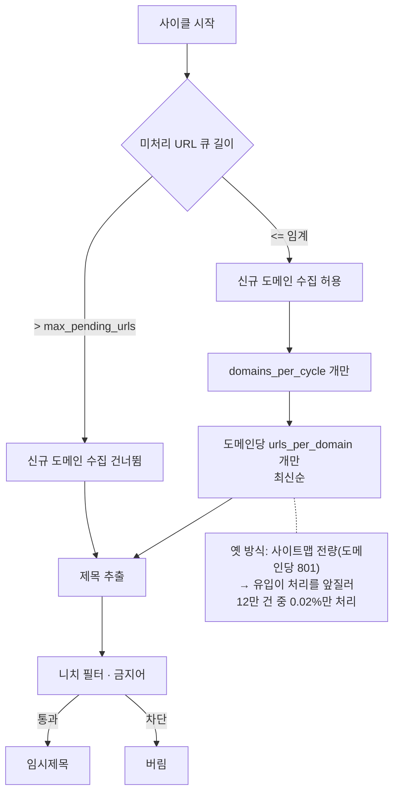
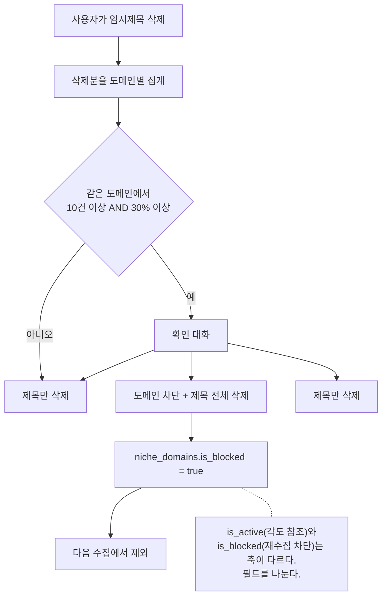
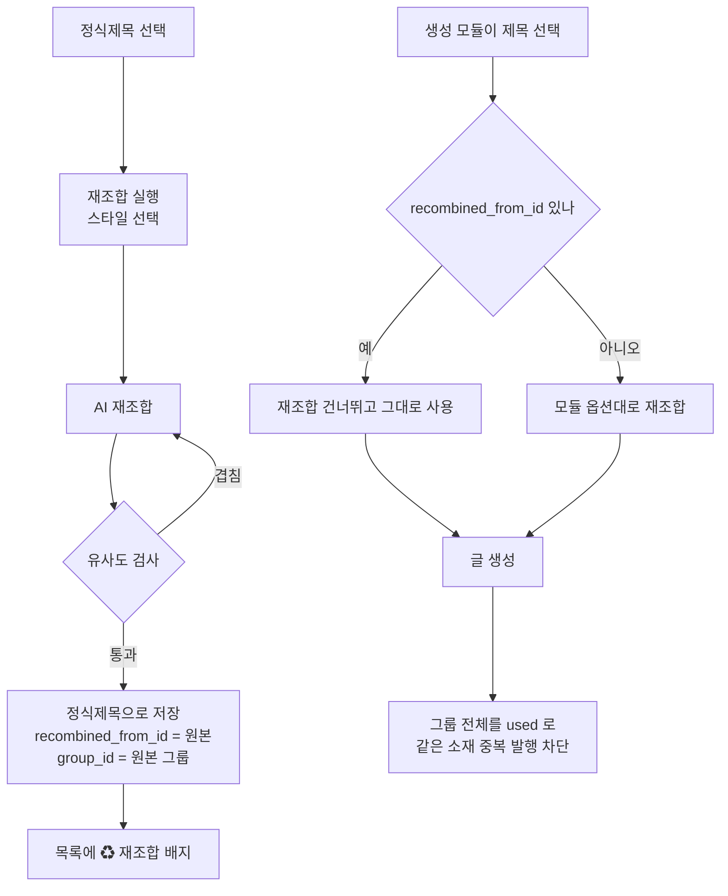
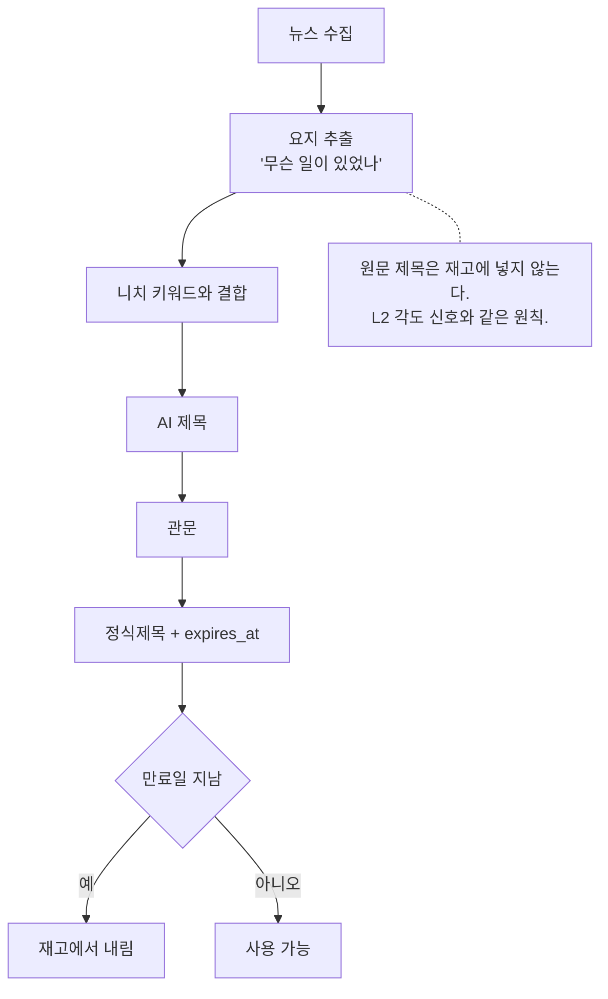

# 임시제목·정식제목 탭 순서도

> 계획서: `docs/plans/title_tab_workplan.md`

## 1. 임시제목 탭 — 섹션 구조

```mermaid
flowchart TD
    A[임시제목 탭] --> B{☑ 수집}
    A --> C{☑ 생성}
    B -->|켬| B1[수집 설정 열림]
    B -->|끔| BX[수집 안 함]
    C -->|켬| C1[생성 설정 열림]
    C -->|끔| CX[생성 안 함]

    B1 --> B2[시드 선택<br/>채택키워드/니치도메인/직접입력]
    C1 --> C2[L1 키워드 기반]
    C1 --> C3[L3 뉴스 시의성]

    B2 & C2 & C3 --> G[관문<br/>금지어→분류→유사도]
    G -->|통과| M[정식제목]
    G -->|미분류| Q[임시제목 = 회수 큐]

    note["키워드 모듈과 같은 원리.<br/>한 섹션만 켜면 그 기능 전용."]
    A -.- note
```

## 2. 수집 — 유입 제어 (핵심 개선)

```mermaid
flowchart TD
    S[사이클 시작] --> Q{미처리 URL 큐 길이}
    Q -->|> max_pending_urls| P1[신규 도메인 수집 건너뜀]
    Q -->|<= 임계| P2[신규 도메인 수집 허용]
    P2 --> D[domains_per_cycle 개만]
    D --> U[도메인당 urls_per_domain 개만<br/>최신순]
    P1 & U --> E[제목 추출]
    E --> F[니치 필터 · 금지어]
    F -->|통과| T[임시제목]
    F -->|차단| X[버림]

    old["옛 방식: 사이트맵 전량(도메인당 801)<br/>→ 유입이 처리를 앞질러<br/>12만 건 중 0.02%만 처리"]
    U -.- old
```

## 3. 도메인 대량 삭제 → 차단

```mermaid
flowchart TD
    A[사용자가 임시제목 삭제] --> B[삭제분을 도메인별 집계]
    B --> C{같은 도메인에서<br/>10건 이상 AND 30% 이상}
    C -->|아니오| Z[제목만 삭제]
    C -->|예| D[확인 대화]
    D --> E[도메인 차단 + 제목 전체 삭제]
    D --> F[제목만 삭제]
    D --> Z
    E --> G["niche_domains.is_blocked = true"]
    G --> H[다음 수집에서 제외]

    note["is_active(각도 참조)와<br/>is_blocked(재수집 차단)는 축이 다르다.<br/>필드를 나눈다."]
    G -.- note
```

## 4. 재조합 — 정식제목 탭

```mermaid
flowchart TD
    A[정식제목 선택] --> B[재조합 실행<br/>스타일 선택]
    B --> C[AI 재조합]
    C --> D{유사도 검사}
    D -->|겹침| C
    D -->|통과| E["정식제목으로 저장<br/>recombined_from_id = 원본
    group_id = 원본 그룹"]
    E --> F["목록에 ♻ 재조합 배지"]

    G[생성 모듈이 제목 선택] --> H{recombined_from_id 있나}
    H -->|예| I[재조합 건너뛰고 그대로 사용]
    H -->|아니오| J[모듈 옵션대로 재조합]
    I & J --> K[글 생성]
    K --> L[그룹 전체를 used 로<br/>같은 소재 중복 발행 차단]
```

## 5. L3 뉴스 시의성

```mermaid
flowchart TD
    A[뉴스 수집] --> B["요지 추출<br/>'무슨 일이 있었나'"]
    B --> C[니치 키워드와 결합]
    C --> D[AI 제목]
    D --> E[관문]
    E --> F["정식제목 + expires_at"]
    F --> G{만료일 지남}
    G -->|예| H[재고에서 내림]
    G -->|아니오| I[사용 가능]

    note["원문 제목은 재고에 넣지 않는다.<br/>L2 각도 신호와 같은 원칙."]
    B -.- note
```
