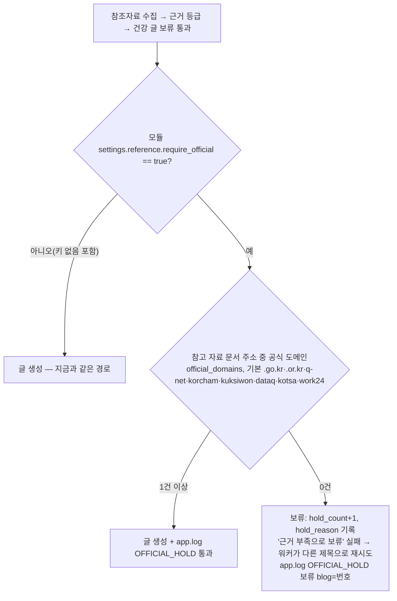

# 제목 관문 + 건강 글 보류 (2026-10-07)

마케팅 검수(형 승인 10/7) — 공개 글 11편이 비공개·수정 대상이 됐다. 원인은 모두
제목 단계에서 알 수 있던 것이라, 자동 생성은 **글을 만들기 전에** 제목을 거른다.

코드: `app/services/generation/topic_gate.py`, `app/services/generation/health_hold.py`

## 제목 관문 (자동 생성 경로, 카테고리 관문 다음)

```mermaid
flowchart TD
    A[재고 확인 → 제목 확정] --> B{카테고리 관문}
    B -- 밖 --> X1[건너뜀]
    B -- 안 --> C{위험주제?<br/>전화번호·영업시간·시간표·운행 정보·채용조건·상품권}
    C -- 예 --> P[제목 보관 archived<br/>hold_reason='제목 관문(…)'] --> X2[건너뜀]
    C -- 아니오 --> D{제목에 지난 연도?<br/>2025 등 올해보다 앞}
    D -- 예 --> P
    D -- 아니오 --> E{대부업체·개별 대출 상품?<br/>대부·캐피탈·저축은행·소액대출·카드론·○○론+대출 문맥<br/>정책상품 햇살론·보금자리론 등은 통과}
    E -- 예 --> P
    E -- 아니오 --> F{제철 주제인데 제철 아님?<br/>제철 시작 한 달 전부터 허용}
    F -- 예 --> T[이번 회차만 건너뜀<br/>제목은 그대로]
    F -- 아니오 --> G{7일 안에 다른 블로그가<br/>같은 정식제목 또는 같은 주제?}
    G -- 예 --> T
    G -- 아니오 --> H[프롬프트 로테이션 → 글 생성]
```

- 보관(archived)은 삭제가 아니다. 정식제목 화면에서 되돌릴 수 있다.
- 작업대(scope_gate=False)는 사람이 고른 제목이라 관문을 거치지 않는다.
- 판정 중 오류가 나면 통과시킨다(로그 `[TOPIC_GATE] 판정 실패`).
- 같은 주제 판정은 일일 점검(품질점검.py)과 같은 기준: 글자 짝 유사도 0.45↑ 또는 핵심 낱말 2개↑·0.3↑.
- 생성 뒤 품질 게이트(quality_gate)는 위험주제를 여전히 '경고'로만 남긴다 — 차단은 이 관문이 한다.

## 건강 글 보류 (생성 파이프라인, 근거 등급 보류 다음)

```mermaid
flowchart TD
    R[참조자료 수집] --> H1{건강형?<br/>주제 이름 또는 제목에 건강·효능·부작용 등}
    H1 -- 아니오 --> W[글 생성]
    H1 -- 예 --> S[공식 기관 추가 검색<br/>질병관리청·국가건강정보포털·식약처·농촌진흥청<br/>기관 첫 화면 URL은 버림]
    S --> K{인용 가능한 공식 출처<br/>요약 대상 문서 중 공식 도메인}
    K -- 1건 이상 --> W2[글 생성 + 글 끝 '참고 자료'(공식만) + 면책]
    K -- 0건 --> HOLD[보류: hold_count+1, hold_reason 기록<br/>'근거 부족으로 보류' 실패 → 워커가 다른 제목으로 재시도]
```

- 카무트(10/5) 원인: 건강형 판정은 됐지만 공식 검색이 `health.kdca.go.kr/`·`foodsafetykorea.go.kr/` 같은
  첫 화면만 돌려줬고, 본문에 '카무트'가 없어 관련성 관문에서 빠져 인용 후보 0건 → 규칙대로 '참고 자료'는
  안 붙었는데 글은 그대로 나가 출처 없는 수치가 실렸다. `[HEALTH_SRC]` 로그는 표준 로거라 app.log에 안 남았다(수정).
- 예전 판정은 주제 이름이 있으면 제목을 보지 않아 '음식/레시피 > 부작용·주의' 제목이 빠질 수 있었다(수정).

## 공식 출처 보류 — 모듈 스위치 (2026-10-08, 건강 글 보류 다음)

취업인포마스터(블로그 17) 애드센스 '가치 없는 콘텐츠' 거절 재정비. 자격증·시험 글은 시행 기관 공고가 근거다.
코드: `app/services/generation/official_hold.py`



- 켠 모듈: 189(취업인포마스터)만. 다른 모듈은 키가 없어 판정 자체를 하지 않는다.
- 도메인 일치: '.go.kr' 처럼 점으로 시작하면 접미사, 아니면 같은 호스트 또는 그 하위 도메인만.
- 사흘 연속 보류면 마케팅에 알린다(제목 교체 또는 검색 보강 판단).

## 같은 블로그 비슷한 제목 — 모듈 스위치 (2026-10-08, 타블로그 중복 다음)

코드: `app/services/generation/same_blog_dedupe.py` · 스위치: 모듈 `settings.dedupe_same_blog`

```mermaid
flowchart TD
    G[제목 관문 통과] --> S{settings.dedupe_same_blog?}
    S -- 아니오 --> H[프롬프트 로테이션 → 글 생성]
    S -- 예 --> N[제목 정규화: 지역명(시·군·구·시도)·연도 지움, 엘지→lg 등 회사 표기 맞춤]
    N --> R[이 블로그 최근 60일 글 제목(정리된 글 제외)도 같은 정규화]
    R --> C[블로그 주제어 뺌: 최근 제목 15%↑(최소 3편)에 나오는 낱말]
    C --> Q{의미 낱말이 똑같거나<br/>2개↑ 겹치고 자카드 0.5↑?}
    Q -- 예 --> T[이번만 건너뜀 — 제목은 창고에 남음(다른 블로그가 씀)<br/>app.log SAME_BLOG]
    Q -- 아니오 --> H
```

- 켜기 기준(모의 10/8): 건너뛴 뒤 남는 제목 ≥ 하루 생성량×30. 이사노트(21)만 미달(42개 중 14개가 이미 낸 글과 같음 → 남음 28) → 끔.
- '7가지·초보자를 위한' 같은 틀 문구만 겹치는 글, '○○ 자격증 취득'처럼 블로그 주제어만 겹치는 글은 같은 글로 보지 않는다.
