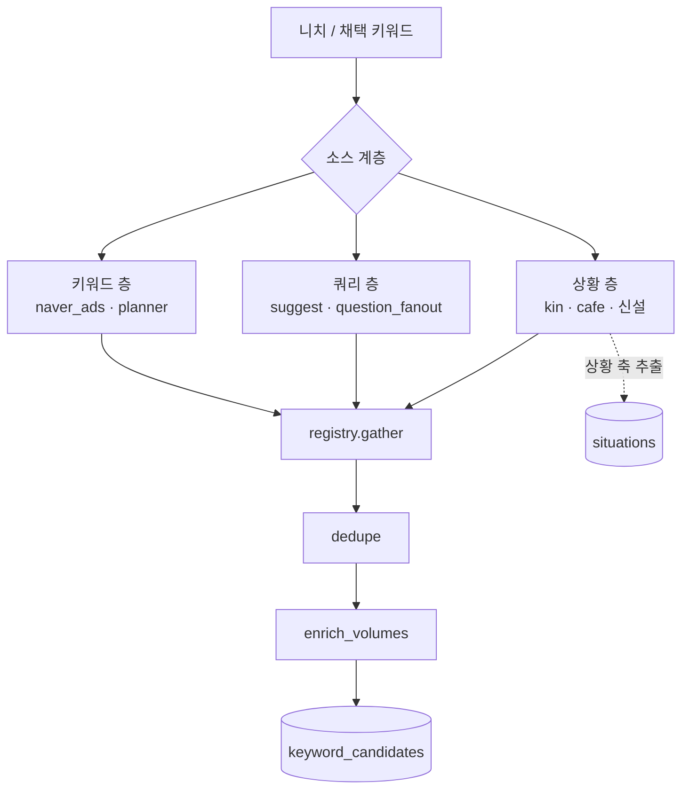
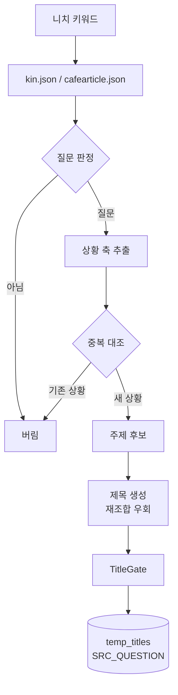
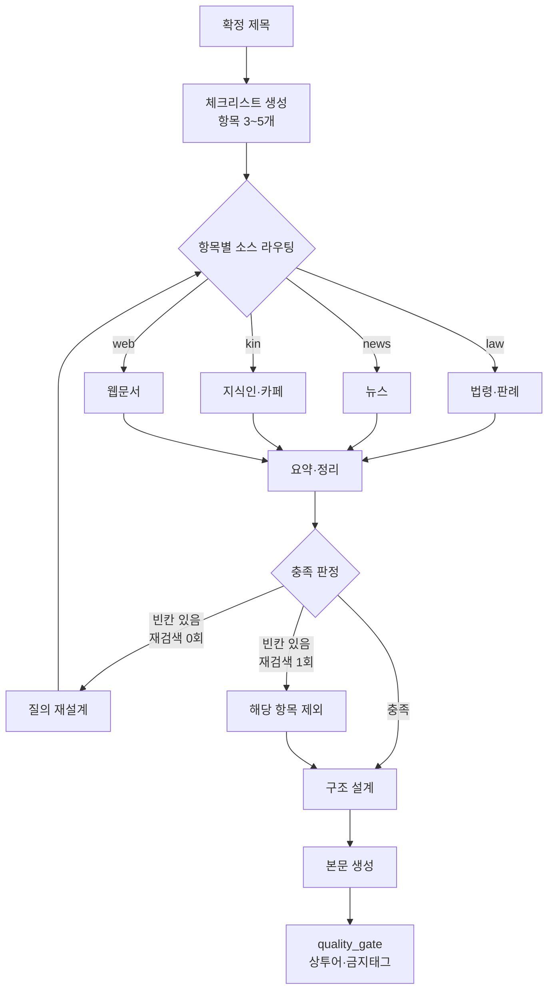
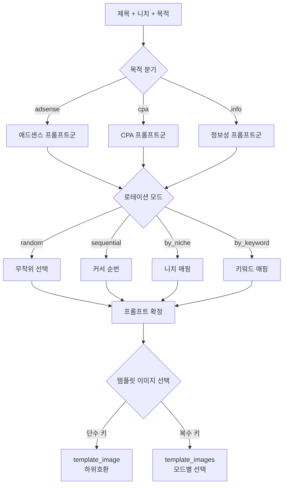

# 주제 발굴·구조 다양화 순서도

> 계획서: `docs/plans/topic_discovery_and_structure_plan.md`

## 1. 소스 계층 (1단계)

```mermaid
flowchart TD
    N[니치 / 채택 키워드] --> S{소스 계층}

    S --> L1[키워드 층<br/>naver_ads · planner]
    S --> L2[쿼리 층<br/>suggest · question_fanout]
    S --> L3[상황 층<br/>kin · cafe · 신설]

    L1 --> R[registry.gather]
    L2 --> R
    L3 --> R

    R --> D[dedupe]
    D --> E[enrich_volumes]
    E --> P[(keyword_candidates)]

    L3 -.상황 축 추출.-> SIT[(situations)]
```

## 2. 질문 발굴 경로 (2단계)

```mermaid
flowchart TD
    A[니치 키워드] --> B[kin.json / cafearticle.json]
    B --> C{질문 판정}
    C -->|아님| X[버림]
    C -->|질문| E[상황 축 추출]
    E --> F{중복 대조}
    F -->|기존 상황| X
    F -->|새 상황| G[주제 후보]
    G --> H[제목 생성<br/>재조합 우회]
    H --> I[TitleGate]
    I --> J[(temp_titles<br/>SRC_QUESTION)]
```

## 3. 근거 체크리스트 (3단계)

```mermaid
flowchart TD
    T[확정 제목] --> C[체크리스트 생성<br/>항목 3~5개]
    C --> R{항목별 소스 라우팅}

    R -->|law| L[법령·판례]
    R -->|news| N[뉴스]
    R -->|kin| K[지식인·카페]
    R -->|web| W[웹문서]

    L --> M[요약·정리]
    N --> M
    K --> M
    W --> M

    M --> V{충족 판정}
    V -->|빈칸 있음<br/>재검색 0회| Q[질의 재설계]
    Q --> R
    V -->|빈칸 있음<br/>재검색 1회| DROP[해당 항목 제외]
    V -->|충족| ST[구조 설계]
    DROP --> ST
    ST --> GEN[본문 생성]
    GEN --> QG[quality_gate<br/>상투어·금지태그]
```

## 4. 구조 다양화 (4단계)

```mermaid
flowchart TD
    P[제목 + 니치 + 목적] --> PU{목적 분기}
    PU -->|adsense| PA[애드센스 프롬프트군]
    PU -->|cpa| PC[CPA 프롬프트군]
    PU -->|info| PI[정보성 프롬프트군]

    PA --> RO{로테이션 모드}
    PC --> RO
    PI --> RO

    RO -->|random| R1[무작위 선택]
    RO -->|sequential| R2[커서 순번]
    RO -->|by_niche| R3[니치 매핑]
    RO -->|by_keyword| R4[키워드 매핑]

    R1 --> OUT[프롬프트 확정]
    R2 --> OUT
    R3 --> OUT
    R4 --> OUT

    OUT --> IMG{템플릿 이미지 선택}
    IMG -->|단수 키| OLD[template_image<br/>하위호환]
    IMG -->|복수 키| NEW[template_images<br/>모드별 선택]
```
