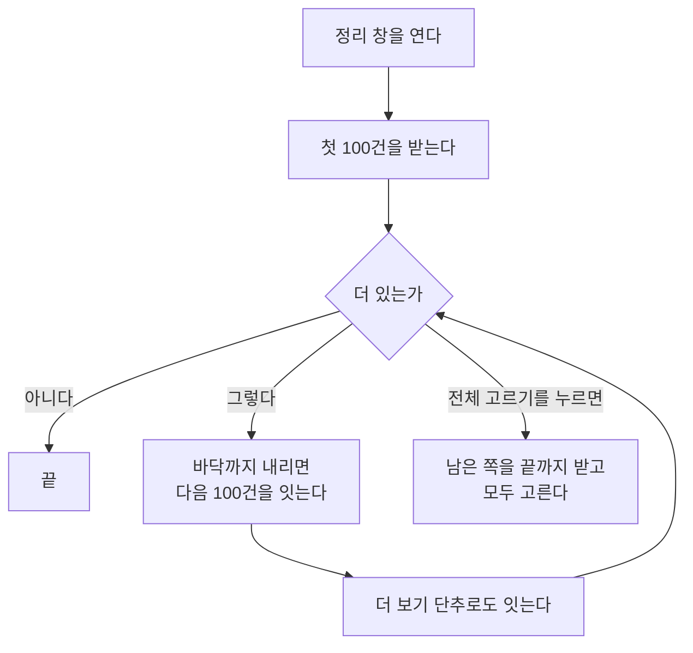

# 미매칭 발행글 정리

## 왜 손봤나

블로그에 발행됐지만 정식제목과 짝이 없는 글을 추리는 창이다. 두 가지가
막혀 있었다.

* 목록을 **한 번에 200건만** 받아 왔다. 그보다 많으면 나머지를 볼 길이
  없었고, 다음 쪽도 스크롤도 없었다.
* **전체 고르기**가 없어 한 건씩 눌러야 했다.

또 검색으로 찾은 미매칭 글 하나를 그 자리에서 정리할 방법이 없었다.
정리 창을 열어 그 글을 다시 찾아야 했다.

## 목록을 끝까지 보는 길

**전체 고르기는 먼저 끝까지 받는다.** 화면에 없는 것이 조용히 빠지면
"전체"라는 말이 거짓이 되기 때문이다. 5,000건에서 멈추며, 그보다 많으면
창 안 검색으로 좁힌다.

## 검색해서 고른 글을 바로 정리하기

정식제목 탭의 목록은 정식제목과 미매칭 발행글을 섞어 보여 준다
(`/titles/unified`). 검색도 둘 다에 걸린다. 그래서 검색 결과에서 미매칭
행을 고르면 **고른 것 막대에 정리 단추**가 뜬다.

    정식제목 등록 · 임시제목 등록 · 발행글 삭제

정리 창에서 쓰는 길과 같은 곳으로 보낸다
(`POST /blogs/{id}/unmatched-posts/{promote-to-main|promote-to-temp|delete}`).

## 함정 — 접근자를 펼쳐 합치면 굳는다

이 묶음은 화면 쪽에서 `...unmatchedCleanupPart()` 로 펼쳐 합친다. 그때
`get` 접근자는 **한 번 불려 값으로 굳는다**. 전체 고르기 표시를 get 으로
두었더니 영영 꺼진 채였다. 그래서 보통 함수로 둔다.
