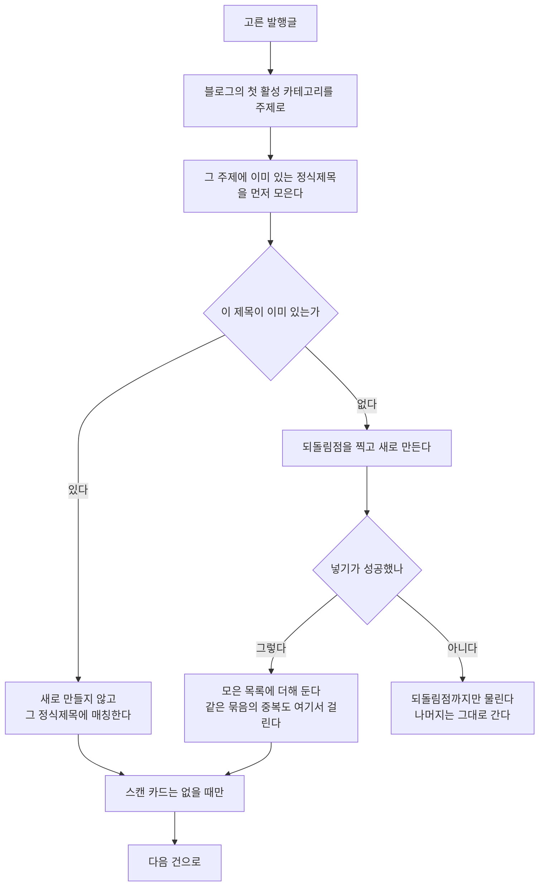

# 미매칭 발행글을 정식제목으로

## 무엇이 터졌나

정리 창에서 **전체를 골라** 정식제목 등록을 누르면 500 이 났다.

    duplicate key value violates unique constraint "uq_main_title_topic"

정식제목은 `(제목, 주제)` 가 겹칠 수 없다. 고른 것 가운데 **이미 정식제목이
있는 제목**이 하나라도 섞이면 거기서 넣기가 깨진다. 더 나쁜 것은 그 뒤다 —
한 번 깨진 트랜잭션은 되돌려질 때까지 아무것도 받지 않아 **나머지 전부가
함께 죽고** 마지막 저장도 터진다. 한 건씩 고르면 성공하던 까닭이 이것이다.

같은 묶음 안에 **같은 제목이 두 번** 들어 있어도 똑같이 깨진다(같은 글이
여러 번 발행된 경우).

## 고친 차례

**한 건이 깨져도 나머지는 산다.** 건마다 되돌림점(savepoint)을 찍어 그
건만 물리기 때문이다.

**이미 있는 제목은 실패가 아니다.** 사용자가 원한 것은 "이 발행글에 정식제목을
붙이는 것"이므로, 같은 제목이 이미 있으면 새로 만들지 않고 거기에 붙인다.

## 돌려주는 값

    promoted  새로 만들어 붙인 수
    linked    이미 있던 정식제목에 붙인 수
    failed    그래도 안 된 수(이유와 함께)
    requested 고른 수

화면은 이 셋을 나누어 알려 준다. "몇 개는 이미 있어 이어 붙였다"가
보이지 않으면 사용자는 무엇이 일어났는지 알 수 없다.

## 곁들임 — 스캔 카드

`blog_main_title_scans` 는 `(블로그, 정식제목)` 이 열쇠다. 이미 있는
제목에 붙일 때는 카드도 이미 있을 수 있으므로, 없을 때만 넣는다.
