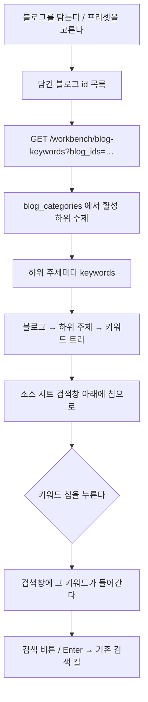

# 담은 블로그의 키워드로 검색창 채우기

## 왜

모듈 테스터에서 글감을 찾으려면 검색창에 키워드를 **손으로** 적어야 했다.
그런데 블로그마다 이미 하위 주제와 키워드를 정해 두었다. 그 키워드를
다시 떠올려 적는 건 헛수고고, 블로그 니치에서 벗어난 검색어를 넣기도 쉽다.

그래서 **담은 블로그의 하위 주제 → 키워드**를 검색창 아래에 펼쳐 두고,
누르면 검색창에 들어가게 한다.

## 흐름

## 규칙

* **블로그가 바뀌면 다시 받는다.** 담기·빼기·프리셋 불러오기 셋 다.
  담은 블로그가 없으면 칩도 없다.
* **누르면 넣기만 한다.** 자동으로 검색하지 않는다 — 두 키워드를 이어
  붙이거나 뒤에 말을 덧붙여 검색하는 일이 잦다. 검색창이 비어 있으면
  그대로, 이미 글자가 있으면 **한 칸 띄워 뒤에 붙인다**. 같은 키워드를
  또 누르면 붙이지 않는다.
* **소유권.** 남의 블로그 id 를 넣어도 내 블로그가 아니면 빈 결과다.
* **지식iN·카페 / 키워드·제목 두 모드 모두** 같은 칩을 쓴다. 검색창이
  하나라서 넣는 자리도 하나다.
* 하위 주제가 많으면 접어 둔다. 기본은 펼침, 접힘 상태는 시트를 닫아도
  유지한다(한 회차 안에서).

## 응답 모양

    { "blogs": [ { "blog_id": 3, "blog_name": "이사노트",
                   "subtopics": [ { "subtopic_id": 12, "subtopic_name": "이사 비용",
                                    "topic_name": "이사",
                                    "keywords": ["이사 견적", "포장이사 비용"] } ] } ] }
