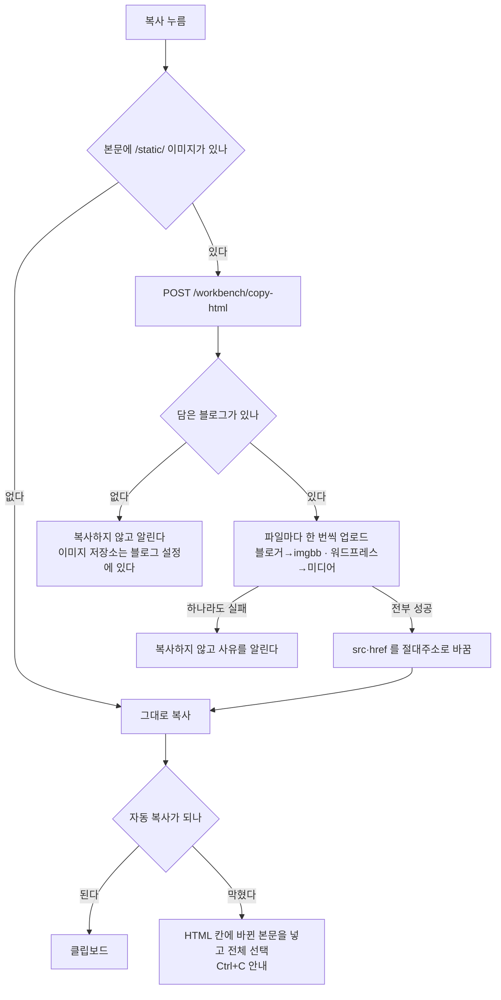

# 복사한 HTML 을 붙여도 이미지가 보이게

## 왜

미리보기 HTML 의 이미지는 우리 서버의 **로컬 경로**다.

    

이걸 그대로 복사해 블로그에 붙이면 주소가 **그 블로그 도메인**으로 해석되어
(`blogspot.com/static/...`) 이미지가 깨진다. 발행 경로에서는 발행 직전에 올려
바꾸므로 문제가 없었지만, 복사해서 직접 붙이는 길에는 그 단계가 없었다.

> 초기에 손으로 쓴 글을 붙여넣었을 때 이미지가 멀쩡했던 것은, 그 파일들이
> 이미 imgbb 주소를 담고 있었기 때문이다(2026-09-27 확인). 모듈 테스터의
> 복사 경로에서 업로드가 일어난 적은 없었다.

## 흐름

## 규칙

* **저장분은 건드리지 않는다.** 발행 경로는 본문의 **로컬 경로**를 보고 표지
  중복을 가려낸다(`html_injector.has_image`). 저장된 본문까지 원격 주소로
  바꾸면 표지가 두 번 들어가던 문제가 되살아난다.
* **같은 파일은 한 번만 올린다.** 표지가 `src` 와 `href` 두 자리에 있어도
  업로드는 한 번이다.
* **하나라도 실패하면 아무것도 바꾸지 않는다.** 반쪽만 바뀐 본문을 붙이면
  어느 이미지가 깨졌는지 알기 어렵다.
* 남의 블로그 id 로는 올리지 않는다(이미지 저장소 키가 블로그 설정에 있다).

## 알아 둘 것

복사할 때마다 새로 올라간다 — 같은 글을 두 번 복사하면 imgbb 에 두 장이
남는다. 붙여넣지 않고 복사만 해도 한 장이 남는다. imgbb 는 우리가 지울 수
없다(삭제 주소를 저장하지 않는다). 발행 경로로 나간 이미지와도 별개다.
