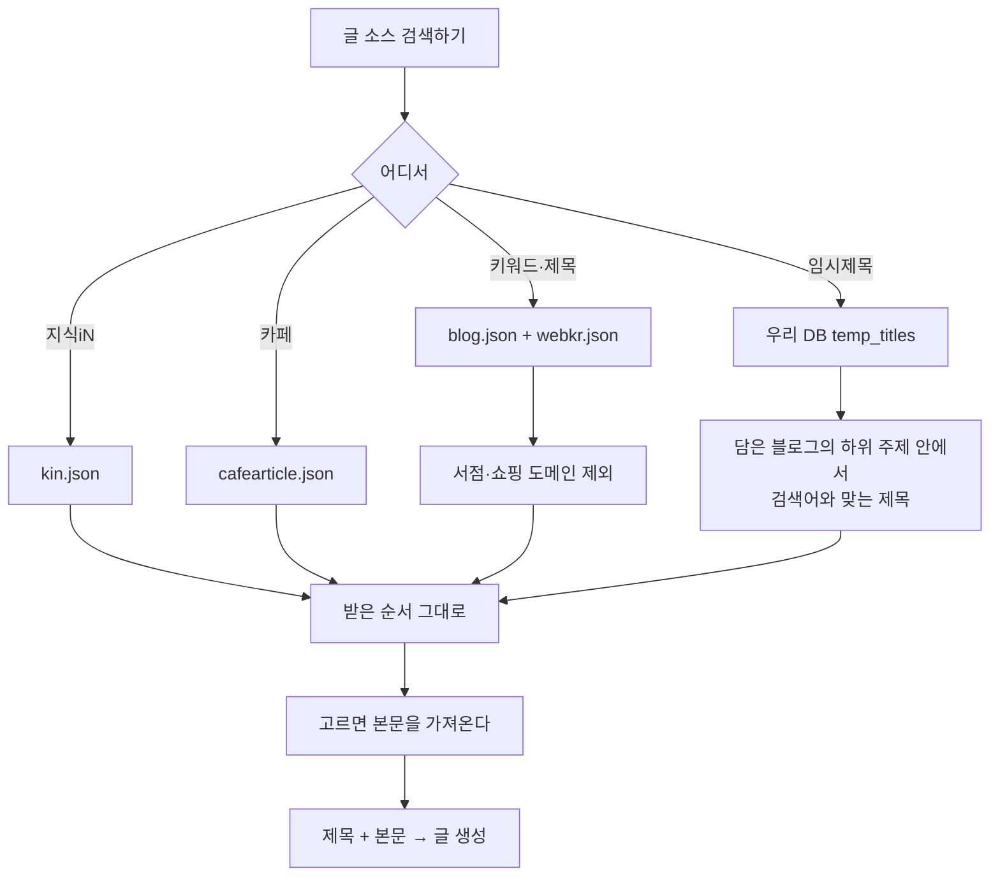
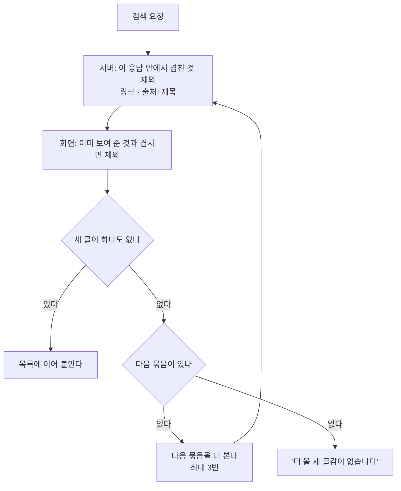

# 글 소스 네 갈래 — 지식iN · 카페 · 키워드·제목 · 임시제목

## 왜 고쳤나 (2026-09-23)

세 가지가 어긋나 있었다.

1. **순서가 네이버와 달랐다.** 지식iN·카페를 `sort=date`(최신순)로 불렀다.
   네이버 화면의 기본은 정확도순이라 같은 검색어인데 다른 글이 위에 왔다.
   게다가 받아 온 뒤 "상황이 실린 질문"을 앞으로 다시 정렬하고, 질문이
   아니라고 판정된 것을 버려서 순서가 한 번 더 흔들렸다.
2. **지식iN과 카페가 한 버튼이었다.** 둘을 한 번에 불러 섞으니 어느 쪽
   결과인지, 그쪽 검색에서 몇 번째였는지 알 수 없었다.
3. **키워드·제목 검색에 서점·쇼핑 페이지가 섞였다.** 웹문서(webkr)는
   웹사이트 색인이라 한 단어 키워드에서는 알라딘·G마켓·나무위키가 위를
   차지한다. 글감으로 쓸 수 없는 것들이다.

## 네 갈래

## 순서를 지키는 규칙

* **정렬은 네이버에 맡긴다.** 기본 `sort=sim`(정확도순), 화면에서 최신순으로
  바꿀 수 있다. 받아 온 뒤 우리가 다시 정렬하지 않는다.
* **버리지 않고 표시한다.** 질문이 아닌 글·홍보 의심 글도 자리를 지키고
  배지(`홍보 의심`)만 단다. 버리면 "네이버에서는 셋째였는데 여기선 첫째"가
  된다. 수집기(`keyword_lab`)는 지금처럼 걸러 쓴다 — 거기선 순서가 아니라
  질이 중요하다.
* 예외는 **글감이 될 수 없는 도메인** 하나다(서점·오픈마켓·가격비교).
  이건 순서 문제가 아니라 애초에 열어 볼 글이 아니다.

## 겹쳐 오는 결과 (2026-09-26 추가)

네이버는 같은 글을 두 모양으로 겹쳐 준다. 실측('이사 견적'):

    지식iN  start=1    한 페이지 30건 안에서 **제목이 같은 것 8건**
                      (링크는 서로 달라 링크만 보면 못 걸러진다)
    지식iN  start=31   앞 페이지와 제목 반복 6건
    카페    start=61   앞 페이지와 **링크까지 같은 것 20건**
    웹      start=31   1건

그래서 두 곳에서 걸러 낸다.

* 판정 규칙은 서버(`workbench/dedup.py`)와 화면이 **같다** — 링크는
  http/https·www·끝 슬래시를 무시하고, 제목은 공백을 줄여 **출처와 함께** 본다.
  출처를 함께 보는 이유: 지식iN 질문과 블로그 글은 제목이 같아도 다른 글이다.
* 순서는 건드리지 않는다. 겹친 것만 빠진다.
* 다 걸러 내면 '더 보기'가 먹지 않는 것처럼 보이므로 다음 묶음까지 이어 본다.

## 키워드 칩은 **바꿔** 넣는다

칩을 누르면 검색창이 그 키워드로 **바뀐다**. 예전에는 뒤에 붙여서, 두 개를
누르면 '포장 이사 보관 이사'가 되어 결과가 사라졌다. 키워드는 하나씩 보는
것이라 마지막에 누른 것만 남긴다.

## 임시제목 검색

담은 블로그 → 연결된 하위 주제 → 그 안의 `temp_titles` 중 검색어와 맞는 것.

    맞다고 보는 것
      제목에 검색어가 있다 ('포장 이사' → '포장이사' 도 맞다)
      또는 그 제목을 걸어 준 카테고리 키워드가 검색어와 같다

담은 블로그가 없으면 검색하지 않는다 — 어느 하위 주제로 좁힐지 알 수 없다.
이미 정식제목으로 옮긴 것(`moved`)은 빼고, 최근 수집한 것부터 보여 준다.
