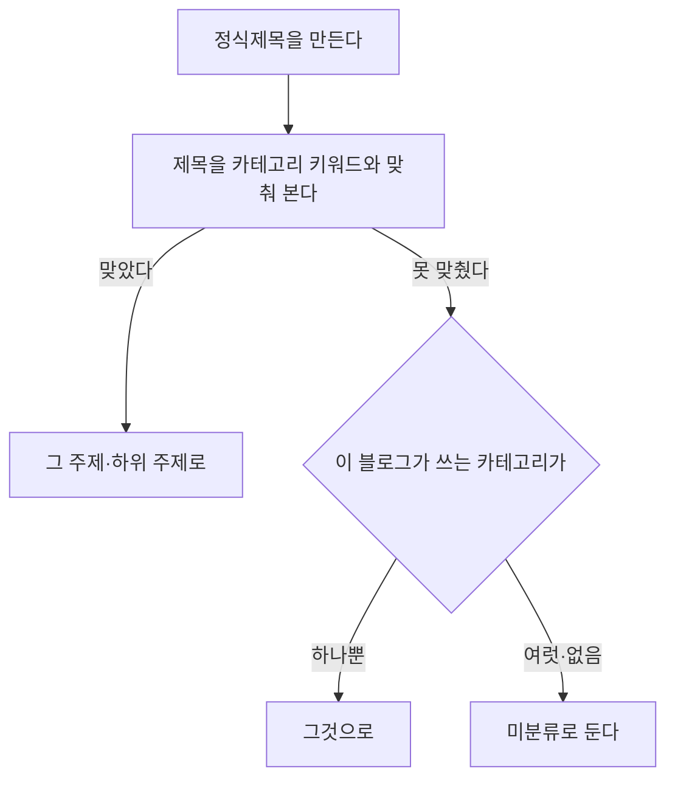

# 모듈 테스터로 낸 글의 카테고리

## 무엇이 비어 있었나

모듈 테스터에서 글을 만들어 발행대기로 두면 그 블로그의 **정식제목**에 한 줄이
생긴다. 그런데 **카테고리가 미분류**로 남았다. 정식제목을 만들 때 제목만
넣고 주제·하위 주제를 채우지 않았기 때문이다.

미분류인 제목은 카테고리로 거르는 화면·재고 계산에서 빠진다.

## 두 단계로 채운다

**1. 제목으로 분류.** 수집한 제목을 분류할 때 쓰는 것과 **같은 장치**
(`CategoryMatcherService`)를 쓴다. 따로 만들면 같은 제목이 화면마다 다른
카테고리로 보인다.

**2. 블로그가 쓰는 카테고리로 물러서기.** 제목이 키워드에 안 걸려도, 그
블로그가 카테고리 하나만 쓰고 있으면 그것이 답이다. 여럿이면 어느 것인지
알 수 없으니 미분류로 둔다 — 틀린 분류보다 빈 칸이 낫다.

## 이미 있는 제목이면

같은 제목이 재고에 이미 있으면 그것을 쓴다. 그 제목이 **미분류일 때만**
채운다 — 사람이 정해 둔 분류를 덮지 않는다.
