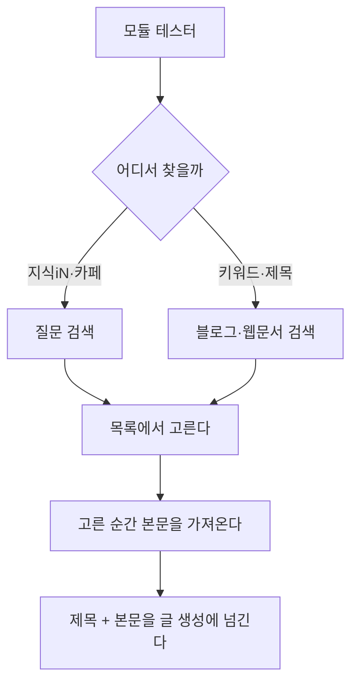

# 키워드·제목으로 찾아 글감 삼기

## 왜

모듈 테스터는 **지식iN·카페 질문**에서만 글감을 가져왔다. 질문에는 상황이
실려 있어 좋지만, 질문이 없는 주제가 있다. 이미 정해 둔 제목으로 쓰고
싶을 때도 길이 없었다.

그래서 **키워드나 제목으로 검색**해 그 결과를 같은 방식으로 고른다.
고르면 본문까지 가져오고, 그 제목과 내용을 바탕으로 글을 만든다.

## 두 갈래, 한 길

고르고 난 **뒤는 완전히 같은 길**이다. 결과 항목의 모양을 맞췄기 때문에
고르기·본문 가져오기·생성으로 이어지는 흐름을 새로 만들지 않았다.

## 찾는 곳

    블로그   openapi.naver.com/v1/search/blog.json
    웹문서   openapi.naver.com/v1/search/webkr.json

둘을 번갈아 섞어 돌려준다. 한쪽에 치우치면 같은 성격의 글만 나온다.

## 본문 가져오기

질문 본문과 달리 **아무 사이트나 올 수 있다**. 그래서 이렇게 한다.

* 네이버 블로그는 `iframe` 안에 본문이 있어 `PostView` 주소로 한 번 더 간다.
* 본문 자리를 아는 곳(티스토리·네이버·브런치)은 그 자리를 먼저 본다.
* 모르는 곳은 `article` → 가장 긴 글 덩어리 순으로 찾는다.
* 스크립트·차림표·꼬리말은 걷어낸다.

너무 짧으면(200자 미만) 못 가져온 것으로 친다 — 목록 요약만 남아 있느니
없는 편이 낫다.

## 글을 쓸 때

가져온 내용은 프롬프트 앞에 얹힌다. **질문과 참고 글은 말이 달라야 한다.**

    지식iN·카페   "질문자가 쓴 내용" · 그 상황에 답하는 글을 쓴다
    웹·블로그     "참고한 글" · 사실만 참고하고 문장·구성은 새로 짠다

같은 문구를 쓰면 남의 블로그 글을 "질문자가 쓴 내용"으로 알아듣고
엉뚱한 글이 나온다. 어느 쪽이든 **문장을 그대로 옮기지 않는다**는 규칙은
같다.

제목도 마찬가지다. 남의 글 제목을 그대로 쓰면 안 되므로 본문이 있는 한
**다시 쓰기** 갈래를 탄다([[title_rewrite_by_source]]).
