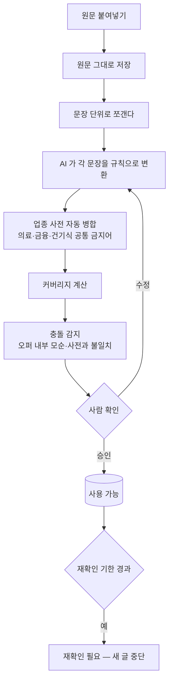

# CPA 제휴 마케팅 — 작업 계획서

> 작성 2026-09-08 | 근거: 애드릭스 「부산ㅎr늘안과 라식/라섹」 실제 가이드라인

## 1. 확정된 전제

| 항목 | 결정 |
|---|---|
| 애드센스 | **연동하지 않는다.** 승인 시도 없음. 필요 시 CPC·배너로 대체 |
| 블로그 분리 | **B안** — 니치당 1블로그, 프로모션당 상담페이지 1~2개 |
| 유료 광고 | **보류** |
| 네트워크 | 애드릭스(가입됨) 주력. 네이버 쇼핑커넥트·알리 추가 검토 |
| 오퍼 입력 | 로그인 필수 페이지라 크롤 불가 → **원문 붙여넣기** |

애드센스를 붙이지 않으므로 구글 애드센스 정책·브릿지 페이지 리스크는 범위에서 빠진다.
**남는 최대 리스크는 의료법이다.** 위반 시 광고주가 영업정지를 맞고, 마케터는
환자 유인알선(의료법 제56조 1항) 방조가 된다.

## 2. 실제 가이드라인에서 읽어낸 제약의 모양

한 오퍼 안에 **성격이 다른 제약이 여덟 종류** 들어 있다. 이걸 그대로 스키마로 만든다.

| 제약 종류 | 실제 예 | 검사 방법 |
|---|---|---|
| **브랜드 난독화** | 풀네임 금지. `부산ㅎr늘안과`만 허용 | 정상 표기 탐지 → 차단 |
| **금지 단어** | 최고·1위·전문·최신·첨단·TOP3·대규모 | 문자열 매칭 |
| **금지 주제** | 할인율·할인비용·구체적 수술비용·전화번호 | 패턴 매칭 |
| **금지 글 유형** | **후기·치료경험담 전면 금지** | 제목 축에서 제외 |
| **없는 것 언급 금지** | 스마일라식·옵티라식·투데이라섹 | 문자열 매칭 |
| **순화 대체** | "무료" → "지원해드립니다" | 프롬프트 지시 + 치환 |
| **필수 문구** | 의료법 주체 명시 + 공정위 대가성 | 존재·위치 검사 |
| **조건부 필수** | 시나가와 언급 시 출처 병기 | 동반 검사 |

**핵심**: 금지어는 AI 지시만으로 못 막는다. 지시(프롬프트)와 검사(발행 전 게이트)
**두 층**으로 간다. 근거 등급에서 쓴 방식과 같다.

## 3. 스키마는 업종별로 만들지 않는다

### 문제

의료 가이드라인 하나로 스키마를 짜면 다음 프로모션에서 깨진다.

```
의료에만 있는 것     브랜드 난독화 · 심의 배너 · 후기 금지
대출에만 있는 것     등록번호 표시 · 경고문구 글자크기 · 최고금리
앱설치에만 있는 것   리워드 유도 금지 · 스토어 지정 · 체류시간
```

의료 스키마에 `브랜드_난독화` 칸을 만들면 앱설치 오퍼에서는 빈칸이고,
앱설치의 `리워드_금지`는 **들어갈 칸이 아예 없어 조용히 사라진다.**
사라진 규칙은 위반으로 돌아온다.

### 해결 — "무엇을 금지하는가" 가 아니라 "어떻게 검사하는가" 로 나눈다

규칙의 **내용**은 업종마다 다르지만, **검사 방식**은 몇 가지로 수렴한다.

| 유형 | 뜻 | 의료 예 | 타 업종 예 |
|---|---|---|---|
| `must_include` | 반드시 포함 | 의료광고 주체 명시 | 대부업 등록번호·이자율 |
| `must_not_include` | 포함 금지 | 최고·1위·전문 | 금융기관 오인 표현 |
| `replace` | 순화 대체 | 무료 → 지원해드립니다 | — |
| `position` | 위치 규칙 | 대가성 문구는 첫 부분 | — |
| `pattern` | 정규식 | `\d+%할인`, 전화번호 | 최고금리 초과 표기 |
| `format` | 표기 형식 | — | 경고문구 글자크기 1/3 |
| `conditional` | X면 Y 필수 | 시나가와 인용 → 출처 | 가격 → 조회시점 명시 |
| `forbidden_topic` | 글 주제 금지 | 후기·구체 비용 | 리워드 지급 유도 |
| `channel` | 매체 허용·금지 | 포털 검색광고 금지 | 구글플레이만 |
| `asset` | 지정 자산만 | 심의 배너 | 브랜드 로고 |
| `conversion` | 전환 조건 | 미승인 6종·접수 3항목 | 실행 후 30초 |
| `content_axis` | 소재 축 | 추천 키워드 9세트 | — |
| `content_source` | 사실 원천 | 주제별 내용 포인트 | — |
| `required_topic` | **내용**을 반드시 다룸 | — | "대출 목적이 아님을 명시" |
| `link_policy` | 링크 구성 제약 | — | 동일 글에 타사 링크 금지 |
| `advisory` | **기계 검사 불가** | "성의 있게 작성" | 본인·지인 DB 등록 금지 |

### 검증 — 실제 오퍼 7건 전수 분해

업종이 전부 다른 실제 오퍼로 확인했다. 규칙을 하나씩 뽑아 유형을 매겼다.

| 오퍼 | 업종 | 규칙 | 유형 | 새로 나온 유형 |
|---|---|---|---|---|
| 부산ㅎr늘안과 | 의료 | 22 | 13 | (최초 13종) |
| 법무법인 중정 | 법률·개인회생 | 19 | 10 | **없음** |
| 법무법인 서앤율 | 법률·이혼 | 15 | 10 | `required_topic` |
| 이사스토리 | 생활서비스 | 6 | 4 | **없음** |
| 현금사은품 인터넷 | 통신 | 2 | 2 | **없음** |
| 야호스탁론 | 금융 | 10 | 8 | `link_policy` |
| 산지식물자원관리사 | 교육 | 6 | 4 | **없음** |

```
규칙 총 80건 → 유형 15종
7개 오퍼 중 4개가 새 유형 0종
```

**수렴한다.** 두 번째 오퍼부터 새 유형이 거의 안 나온다. 업종이 의료 → 법률 →
생활 → 통신 → 금융 → 교육으로 완전히 바뀌었는데도 그렇다.

새로 필요했던 두 종류는 이렇다.

- **`required_topic`** — 문자열이 아니라 **내용**을 반드시 다뤄야 하는 규칙.
  서앤율 "대출 목적이 아님을 명시", "특정 지역만 처리는 어렵다고 명시".
  문자 매칭으로는 못 잡는다. AI 판정이 필요하다.
- **`link_policy`** — 같은 글 안의 링크 구성 제약.
  스탁론 "광고주 링크를 사이트로 등록 금지", 자격증 "동일 포스팅에 타사 링크 금지".

## 3-2. 전수 분해에서 나온 함정 넷

유형 체계보다 이쪽이 더 중요하다. 그냥 만들면 반드시 사고가 난다.

### ① 같은 낱말이 오퍼마다 금지·허용이 갈린다

공통 금지어 사전을 일괄 적용하면 안 된다는 증거다.

| 낱말 | 금지한 오퍼 | 홍보문구로 쓴 오퍼 |
|---|---|---|
| 최고 | 중정·서앤율·안과 | 이사스토리 "최고 20%까지 절약" |
| 전문 | 중정·서앤율·안과 | 이사스토리 "친절하고 전문적입니다" |
| 최저 | 중정·서앤율 | 스탁론 "업계 최저금리" |
| 유일 | 중정·서앤율 | 스탁론 "업계 유일 코스닥 상장" |
| 최대 | 안과 | 인터넷가입 "전국 최대 현금지급 센터" |
| 무료 | 중정·서앤율·안과 | 카바딜러 "무료로" |

**충돌 10건.** 금지어 사전은 반드시 **오퍼 범위**로 관리한다. 전역 사전은
"업종 공통 법정 금지"(의료법·대부업법 등)에만 쓰고, 그것도 오퍼 규칙과
충돌하면 화면에 띄운다.

### ② 오퍼가 자기 규칙을 스스로 어긴다

```
법무법인 중정
  금지 키워드 : 전문, 전담
  자기 소개문 : "전문화된 법률서비스로 의뢰인의 …"

야호스탁론
  금지 키워드 : 금리
  자기 홍보문구 : "월 0.4%대 / 월 0.70%", "업계 최저금리를 제공"
```

명세 안에서 모순이 난다. **자동으로 한쪽을 고르면 안 된다.**
- 광고주 소개문을 그대로 쓰면 → 광고주가 금지한 낱말을 쓴 글이 된다
- 금지어를 문서 전체에 적용하면 → 광고주가 준 홍보문구를 우리가 차단한다

해석은 사람이 한다. 시스템은 **충돌을 찾아 보여주기만** 한다.

### ③ 규칙에는 적용 범위가 있다

스탁론의 "금지키워드 금리"와 본문의 "월 0.4%대"가 공존하는 이유는,
금지키워드가 **제목·태그 범위**이고 본문 언급과 다르기 때문으로 읽힌다.
안과도 "제목/본문에 풀네임 금지"라고 범위를 밝혔다.

그래서 규칙마다 `scope` 를 둔다 — `title` / `keywords` / `body` / `images` / `all`.
범위를 모르면 **가장 넓게(all)** 잡고 사람 확인 목록에 올린다.

### ④ 규칙이 0건인 오퍼가 더 위험하다

이사스토리·현금사은품·카바딜러는 금지사항 항목이 **아예 없다.**
안전해서가 아니라 안 적어 준 것이다. 표시광고법·전기통신사업법은 그대로 적용된다.

게다가 이들의 소개문에 위험 표현이 그대로 있다.

```
현금사은품 : "전국 최대 현금지급 센터", "휴대폰 결합으로 최저요금"
이사스토리 : "최고 20%까지 절약 가능"
카바딜러   : "회원가입 없이 · 무료로 · 1분 만에", "찐 혜택"
```

**규칙 0건이면 보수 모드로 전환한다.** 업종 법정 사전을 강제 적용하고,
광고주 소개문의 최상급·단정 표현은 그대로 옮기지 않는다.

## 4. 붙여넣기 → 구조화

사용자는 **가공 없이 그대로** 붙여넣는다. 정리는 시스템이 한다.



### 놓친 규칙을 보이게 만든다

AI 가 모든 문장을 규칙으로 바꾸리라 기대하지 않는다. **못 바꾼 문장을
화면에 그대로 보여준다.**

```
원문 문장 62개 중 규칙 변환 51개 (82%)
미분류 11개  ← 이 목록을 사람이 직접 본다
```

색인·유입 작업에서 배운 것을 그대로 적용한다. 매칭률을 로그에만 남겼더니
0% 인 것을 아무도 몰랐다. **화면에 없으면 없는 것과 같다.**

`advisory` 유형(성의 있게 작성 등)은 기계가 못 지킨다. 이것도 숨기지 않고
"사람이 봐야 할 항목"으로 따로 모아 보여준다.

## 5. 글 생성

### 제목 — 콘텐츠 축이 그대로 재고가 된다

가이드라인이 **주제 9개 × 키워드 다수 + 각 주제의 내용 포인트**를 이미 준다.
이걸 제목 재고로 변환하면 **오퍼 1개에서 글 수십 편**이 나온다. 이게 자동화의 이득이다.

```
축 9개 × 키워드 3~5개 = 제목 30~45개
        ↓
각 제목에 해당 축의 "내용 포인트"를 본문 개요로 부여
```

**후기 축은 만들지 않는다.** 이 오퍼는 후기가 금지다. 오퍼별로 금지 축을 둔다.

**축이 없는 오퍼도 있다.** 이 의료 가이드라인은 친절해서 키워드와 내용을 다 줬지만,
"랜딩 보고 알아서 쓰세요" 로 끝나는 오퍼가 더 흔하다. 그때는 기존 키워드 모듈로
축을 만들고, `content_source` 가 비었으므로 **근거 없는 수치·효능을 쓰지 못하게**
막는다. 근거 등급의 B등급 규칙(수치 금지, 확인처 안내)과 같은 취급이다.

### 본문 — 근거 규칙

근거 등급(`evidence.py`)의 사고를 그대로 옮긴다.

> **오퍼 명세에 있는 것만 쓴다.** 명세에 없는 수치·효능·혜택을 지어내면
> 네트워크 규정 위반이자 의료법 위반이다.

프롬프트에 넣을 것:
- 허용된 브랜드 표기형만 사용
- 금지어·금지 주제 목록
- 순화 대체 문구
- 해당 축의 내용 포인트 (사실 원천)
- 필수 문구 2종과 위치
- "가이드라인 복붙 금지 — 상세하고 성의 있게" (광고주 요구사항)

### 상담 페이지

프로모션당 1~2개. 정보성 글에서 유도한다. 기존 자산 재사용:
`required_pages_service` · `blogger_page_publisher` · `contact_form_provisioner`(Tally).

애드센스를 안 붙이므로 분량 요건은 없지만, **검색엔진의 thin affiliate 판정**은
애드센스와 별개로 존재한다. 상담 페이지도 실제 정보를 담는다.

## 6. 발행 전 검증 게이트

프롬프트를 어겨도 여기서 잡는다. 하나라도 실패하면 **보류**(3회 보류 워크플로우 재사용).

**게이트는 업종을 모른다.** 규칙 유형만 알면 된다.

| 유형 | 검사 | 의료 오퍼에서 실제로 하는 일 |
|---|---|---|
| `must_include` | 문자열 존재 | 의료광고 주체 명시 + 공정위 문구 |
| `position` | 위치 | 제목 `[광고]` 또는 본문 첫 부분 |
| `must_not_include` | 문자열 부재 | 최고·1위·전문·할인·미보유 시술·정상 브랜드 표기 |
| `pattern` | 정규식 부재 | `\d+%할인`, 수술건수, 전화번호, 구체 비용 |
| `replace` | 원표현 부재 | 무료·특별혜택 |
| `conditional` | 동반 존재 | 시나가와 → 출처 |
| `forbidden_topic` | 주제 분류 | 후기·경험담 |
| `asset` | 등록 자산만 | 심의 배너 외 이미지 |
| `format` | 표기 형식 | (의료 오퍼에는 해당 없음) |
| `channel` | 발행 대상 | 블로그·카페 외 차단 |
| `required_topic` | **AI 판정** | (의료 오퍼에는 해당 없음) |
| `link_policy` | 링크 구성 | 등록된 타 오퍼 랜딩 URL 출현 |
| `advisory` | **검사 안 함** | 사람 확인 목록에만 표시 |

새 업종 오퍼가 들어와도 **게이트 코드는 그대로**다. 규칙 데이터만 바뀐다.

**차단 사유를 동작로그에 그대로 남긴다.** 어느 규칙에 걸렸는지, 원문 어느
문장에서 온 규칙인지까지 적는다. 조용히 멈추면 고장과 구분되지 않는다.

## 7. 단계

| 단계 | 내용 | 규모 |
|---|---|---|
| P1 | 오퍼 모델 + 붙여넣기 등록·확인 화면 + 재확인 기한 | 중 |
| P2 | 원문 → 규칙 변환(AI + 업종 사전) + 커버리지 표시 | 중 |
| P3 | 콘텐츠 축 → 제목 재고 변환 | 소 |
| P4 | CPA 프롬프트 모듈 (오퍼 근거 규칙) | 중 |
| P5 | 검증 게이트(유형 기반, 업종 무관) | 중 |
| P6 | 상담 페이지 템플릿·자동 생성 | 중 |
| P7 | 서브아이디 삽입 + 글별 성과 추적 | 중 |

P1~P5가 "안전하게 글이 나가는" 최소 단위다.

## 8. 남은 리스크

- **의료법**: 위반 시 광고주 영업정지, 마케터 유인알선 방조. 자동화 대상 중
  가장 위험한 업종이다. 첫 오퍼로 의료를 잡은 것은 난이도가 높은 선택이다.
- **오퍼 조건 변경**: 우리가 알 수 없다. 재확인 기한으로만 방어한다.
- **미분류 규칙**: AI 가 못 읽은 문장은 검사되지 않는다. 커버리지를 화면에
  띄워 사람이 보게 하는 것이 유일한 방어다. 100% 자동은 불가능하다.
- **오퍼 내부 모순**: 실측 확인됨(중정·스탁론). 자동 해소하지 않고 사람에게 넘긴다.
- **규칙 0건 오퍼**: 3/7 건이 금지사항을 안 적어 줬다. 보수 모드로 방어하지만,
  광고주가 나중에 문제 삼을 여지는 남는다.
- **`required_topic` 판정**: AI 가 "대출 목적이 아님을 명시했는가" 를 판정해야 한다.
  문자 매칭이 아니라 오판 여지가 있다. 프록시 문구를 함께 두어 이중으로 본다.
- **네트워크 정산**: 리더스CPA 미지급 보도(2024). 애드릭스도 정산 이력 관찰 필요.
- **네이버 채널**: 카페·지식인은 국내 CPA 주력이나 계정 정지 위험이 크다.
  **자동화 대상에서 제외**한다.
