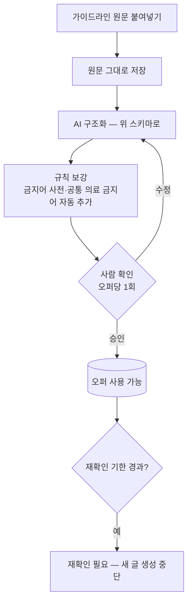

# CPA 제휴 마케팅 — 작업 계획서

> 작성 2026-09-08 | 근거: 애드릭스 「부산ㅎr늘안과 라식/라섹」 실제 가이드라인

## 1. 확정된 전제

| 항목 | 결정 |
|---|---|
| 애드센스 | **연동하지 않는다.** 승인 시도 없음. 필요 시 CPC·배너로 대체 |
| 블로그 분리 | **B안** — 니치당 1블로그, 프로모션당 상담페이지 1~2개 |
| 유료 광고 | **보류** |
| 네트워크 | 애드릭스(가입됨) 주력. 네이버 쇼핑커넥트·알리 추가 검토 |
| 오퍼 입력 | 로그인 필수 페이지라 크롤 불가 → **원문 붙여넣기** |

애드센스를 붙이지 않으므로 구글 애드센스 정책·브릿지 페이지 리스크는 범위에서 빠진다.
**남는 최대 리스크는 의료법이다.** 위반 시 광고주가 영업정지를 맞고, 마케터는
환자 유인알선(의료법 제56조 1항) 방조가 된다.

## 2. 실제 가이드라인에서 읽어낸 제약의 모양

한 오퍼 안에 **성격이 다른 제약이 여덟 종류** 들어 있다. 이걸 그대로 스키마로 만든다.

| 제약 종류 | 실제 예 | 검사 방법 |
|---|---|---|
| **브랜드 난독화** | 풀네임 금지. `부산ㅎr늘안과`만 허용 | 정상 표기 탐지 → 차단 |
| **금지 단어** | 최고·1위·전문·최신·첨단·TOP3·대규모 | 문자열 매칭 |
| **금지 주제** | 할인율·할인비용·구체적 수술비용·전화번호 | 패턴 매칭 |
| **금지 글 유형** | **후기·치료경험담 전면 금지** | 제목 축에서 제외 |
| **없는 것 언급 금지** | 스마일라식·옵티라식·투데이라섹 | 문자열 매칭 |
| **순화 대체** | "무료" → "지원해드립니다" | 프롬프트 지시 + 치환 |
| **필수 문구** | 의료법 주체 명시 + 공정위 대가성 | 존재·위치 검사 |
| **조건부 필수** | 시나가와 언급 시 출처 병기 | 동반 검사 |

**핵심**: 금지어는 AI 지시만으로 못 막는다. 지시(프롬프트)와 검사(발행 전 게이트)
**두 층**으로 간다. 근거 등급에서 쓴 방식과 같다.

## 3. 오퍼 명세 스키마

실제 값으로 채운 예다. 이 구조를 그대로 모델로 만든다.

```
[식별]
  network        애드릭스
  offer_id       6936855
  name           부산ㅎr늘안과 라식/라섹
  advertiser     부산ㅎr늘안과 (부산 서면)
  vertical       의료 — 안과 (규제 업종)

[전환]
  action         상담 신청 (DB 수집)
  fields         이름 / 핸드폰번호 / 문의내용
  reject_reasons 오류, 결번, 중복, 미성년자, 장기부재, 상담거절

[브랜드 표기]
  forbidden_forms  부산하늘안과, 하늘안과 (풀네임)
  allowed_forms    부산ㅎr늘안과, 부산ㅎㅏ늘안과, 부산ㅎ├늘안과
  confusable       강남하늘안과 (별개 병원 — 서울점·강남점·부산점 표기 금지)
  rule             제목·본문 모두 난독화 표기만

[금지]
  words     최고 최상 최대 1위 최우선 대규모 최신 최첨단 첨단 TOP3 전문
            폭탄할인 초특가 추가할인 동반할인 가족할인 지인할인
            부작용 0% 오류 0% 무료 0원 세일 할인율
  patterns  \d+%\s*할인 / \d+만원\s*할인 / 수술건수\s*[\d,]+
            전화번호 형태 / 구체 수술비용
  topics    후기·치료경험담 (본인 경험 포함 절대 금지)
            할인·이벤트·특별혜택 소구
            구체적 비용 공개
  services  스마일라식 옵티라식 투데이라섹 (본원 미보유)

[순화 대체]
  "특별혜택/이벤트/할인"     → "라식라섹 비용이 궁금하다면?"
  "정밀검사 무료/0원"        → "정밀검사 가능 / 검사는 지원해드립니다"
  "전문 안과"                → "부산 서면에 위치한 라식·라섹 잘하는"

[필수 문구]
  medical   "해당 포스팅은 부산ㅎr늘안과 주최로 진행되는 홍보성 내용으로
             경제적 대가를 지원받아 작성된 글입니다."
  ftc       "이 포스팅은 애드릭스 수익이 발생합니다."
  position  제목 앞 [광고] 또는 본문 첫 부분
            (공정위 2024-12-01 개정: 끝부분 게재 불가,
             "받을 수 있음" → "지급받음")

[조건부]
  시나가와 라식센터 연구결과 인용 시 → 출처 문구 반드시 병기

[매체]
  allowed    블로그·카페 포스팅 (의료광고 심의 대상 아님)
  forbidden  네이버 파워링크·파워컨텐츠·플레이스광고 (심의 필요)
  sns        인스타·페북·밴드·앱 → 심의받은 배너 이미지만 사용

[이미지]
  source     드롭박스 (심의 배너)
  rule       심의 배너 외 사용 시 의료법 위반
  cost_image 비용 이미지는 모자이크 필수

[콘텐츠 축]  ← 제목·본문 생성의 원천
  1 병원소개    부산안과, 라식잘하는곳, 라식안과, 부산라식 …
  2 장비        아마리스레드, 레드라식, 1050레드장비 …
  3 노안        노안라식, 4050라식, 부모님라식라섹 …
  4 회복기간    라식회복기간, 라식통증, 라섹회복 …
  5 사후관리    라식수술 사후관리, 라식 후 관리 …
  6 원데이      직장인라식, 퇴근후라식, 주말라식 …
  7 부작용예방  원추각막, 안구건조증, 라식 부작용 …
  8 정밀검사    부산라식검사, 라식검사비용 …
  9 비용        라식비용, 라섹가격, 라식저렴한곳 …

[관리]
  raw_text     원문 전체 보존 (분쟁 시 대조 근거)
  registered   2026-09-08
  recheck_due  2026-10-08 (30일)
  status       확인대기 / 사용중 / 재확인필요 / 중단
```

**원문을 반드시 보존한다.** 구조화 결과는 파생물이고, 다툼이 생기면 원문이 근거다.

## 4. 붙여넣기 → 구조화

사용자는 **가공 없이 그대로** 붙여넣는다. 정리는 시스템이 한다.



**AI 구조화만 믿지 않는다.** 업종별 공통 금지어(의료·금융·건강기능식품)를 사전으로
두고 자동 합친다. 가이드라인에 안 적혀 있어도 의료법 위반인 표현이 있다.

스크린샷 제공도 가능하다 하셨으므로, 이미지 첨부 시 텍스트 추출을 붙인다.

## 5. 글 생성

### 제목 — 콘텐츠 축이 그대로 재고가 된다

가이드라인이 **주제 9개 × 키워드 다수 + 각 주제의 내용 포인트**를 이미 준다.
이걸 제목 재고로 변환하면 **오퍼 1개에서 글 수십 편**이 나온다. 이게 자동화의 이득이다.

```
축 9개 × 키워드 3~5개 = 제목 30~45개
        ↓
각 제목에 해당 축의 "내용 포인트"를 본문 개요로 부여
```

**후기 축은 만들지 않는다.** 이 오퍼는 후기가 금지다. 오퍼별로 금지 축을 둔다.

### 본문 — 근거 규칙

근거 등급(`evidence.py`)의 사고를 그대로 옮긴다.

> **오퍼 명세에 있는 것만 쓴다.** 명세에 없는 수치·효능·혜택을 지어내면
> 네트워크 규정 위반이자 의료법 위반이다.

프롬프트에 넣을 것:
- 허용된 브랜드 표기형만 사용
- 금지어·금지 주제 목록
- 순화 대체 문구
- 해당 축의 내용 포인트 (사실 원천)
- 필수 문구 2종과 위치
- "가이드라인 복붙 금지 — 상세하고 성의 있게" (광고주 요구사항)

### 상담 페이지

프로모션당 1~2개. 정보성 글에서 유도한다. 기존 자산 재사용:
`required_pages_service` · `blogger_page_publisher` · `contact_form_provisioner`(Tally).

애드센스를 안 붙이므로 분량 요건은 없지만, **검색엔진의 thin affiliate 판정**은
애드센스와 별개로 존재한다. 상담 페이지도 실제 정보를 담는다.

## 6. 발행 전 검증 게이트

프롬프트를 어겨도 여기서 잡는다. 하나라도 실패하면 **보류**(3회 보류 워크플로우 재사용).

| 검사 | 내용 | 실패 시 |
|---|---|---|
| 브랜드 표기 | 정상 표기(`부산하늘안과`) 출현 | 차단 |
| 혼동 표기 | `강남`, `서울점`, `강남점`, `부산점` | 차단 |
| 금지어 | 사전 매칭 | 차단 |
| 금지 패턴 | 할인율·수술건수·전화번호·구체 비용 | 차단 |
| 미보유 시술 | 스마일라식 등 | 차단 |
| 필수 문구 | 의료법 주체 명시 + 공정위 대가성 **둘 다** | 차단 |
| 문구 위치 | 제목 `[광고]` 또는 본문 첫 부분 | 차단 |
| 조건부 출처 | 시나가와 언급 시 출처 병기 | 차단 |
| 링크 | 랜딩 URL 정상·서브아이디 삽입 | 차단 |
| 이미지 | 심의 배너 목록 외 사용 | 차단 |

**차단 사유를 동작로그에 그대로 남긴다.** 조용히 멈추면 고장과 구분되지 않는다.

## 7. 단계

| 단계 | 내용 | 규모 |
|---|---|---|
| P1 | 오퍼 모델 + 붙여넣기 등록·확인 화면 + 재확인 기한 | 중 |
| P2 | 원문 → 명세 구조화(AI + 업종 사전) | 중 |
| P3 | 콘텐츠 축 → 제목 재고 변환 | 소 |
| P4 | CPA 프롬프트 모듈 (오퍼 근거 규칙) | 중 |
| P5 | 발행 전 검증 게이트 | 중 |
| P6 | 상담 페이지 템플릿·자동 생성 | 중 |
| P7 | 서브아이디 삽입 + 글별 성과 추적 | 중 |

P1~P5가 "안전하게 글이 나가는" 최소 단위다.

## 8. 남은 리스크

- **의료법**: 위반 시 광고주 영업정지, 마케터 유인알선 방조. 자동화 대상 중
  가장 위험한 업종이다. 첫 오퍼로 의료를 잡은 것은 난이도가 높은 선택이다.
- **오퍼 조건 변경**: 우리가 알 수 없다. 재확인 기한으로만 방어한다.
- **네트워크 정산**: 리더스CPA 미지급 보도(2024). 애드릭스도 정산 이력 관찰 필요.
- **네이버 채널**: 카페·지식인은 국내 CPA 주력이나 계정 정지 위험이 크다.
  **자동화 대상에서 제외**한다.
