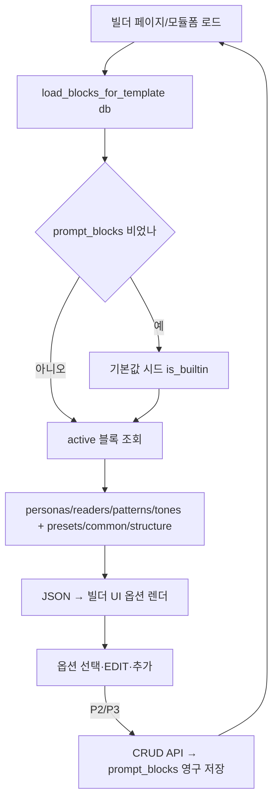

# 프롬프트 빌더 DB화 + 옵션 영구저장 + 구조 다양화 작업계획서

> 작성 2026-06-06 | 목표: 빌더 옵션(페르소나·독자·패턴·톤)을 DB로 옮겨 영구 저장/추가/수정 가능하게 하고, 패턴(구조) 축을 실제로 다양화한다.

## 배경 (확인된 현황)
- 옵션 블록은 `services/prompt_builder/blocks.py`에 **하드코딩** → `blocks_for_template()` → JSON → 빌더 UI(클라이언트 조립).
- 옵션 EDIT는 `overrides`에 임시 저장되나 선택 변경 시 리셋 = **1회성**. 커스텀 프리셋은 **localStorage(브라우저)** 만.
- 서버 저장 경로 없음(라우터 GET만). `build_prompt()`는 서버 미사용(조립은 client `app.js`).
- 패턴 P1~P5는 **구조가 전부 동일**(6섹션·표2·목록2) → 다양성 없음.

## 단계 (Phase)
- **P1 (기반): 데이터 모델 + 시드 + 로딩** ← 이번 착수
  - `PromptBlock` 모델 + alembic 043(prompt_blocks 테이블)
  - 기존 기본값을 시드(is_builtin=True, 멱등)
  - `blocks_for_template`을 DB 읽기로 (없으면 상수 폴백)
- **P2 (CRUD): 옵션 관리 API + 서비스** — 추가/수정/삭제/활성토글
- **P3 (UI): 빌더에서 옵션 영구 저장/추가** — EDIT 저장, 신규 옵션 추가, localStorage 프리셋 → DB(선택)
- **P4 (구조 다양화): 패턴 축 실제 차별화** — 패턴마다 섹션수/표·목록 위치/전개 다르게, 고정 STRUCTURE 이중지시 제거, 제목 A/B/C 누출 금지 규칙
- **P5: 통합·테스트** — 신규 모듈 생성 시 빌더 반영, 생성 테스트

## 데이터 모델 (P1)
`prompt_blocks`:
- `block_type` (persona|reader|pattern|tone), `code`, `label`, `body`(Text)
- `cluster`(nullable), `sort_order`, `is_active`, `is_builtin`
- UNIQUE(block_type, code)

## 비고
- P1은 기존 동작 100% 보존(시드값 = 현재 상수). 화면/생성 결과 변화 없음, 단지 출처가 DB로 바뀜.
- 패턴 구조 다양화(P4)는 옵션 다양화의 전제(없으면 결과가 같은 골격으로 납작해짐).
