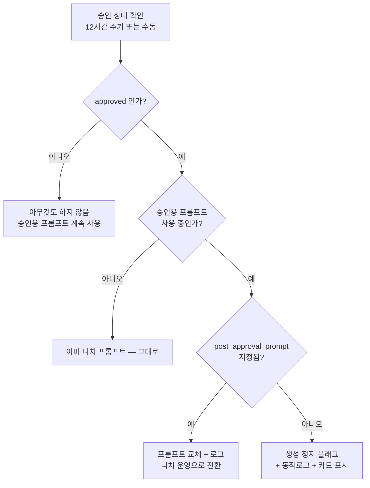

# 애드센스 승인 시 프롬프트 자동 전환 — 수정 방안 (2026-08-30)

> 사용자 지적: 생성에 쓰이는 프롬프트는 `user_prompt_template` 한 칸뿐이라,
> 승인용 프롬프트를 쓰다가 승인되면 자동으로 바꿀 방법이 없다.
> **수정은 미진행. 방안 제안 단계.**

## 1. 점검 결과 — 결함 3건

### (a) ★ 런타임 교체가 생성에 도달하지 않는다 (기존 구현이 죽어 있음)

2026-08-28 에 넣은 `post_approval_prompt` 는 `resolve_for_blog()` 가 실행용
settings 사본의 프롬프트를 바꾸는 방식이었다. 그런데 실제 생성 경로는 이렇다.

```
flow_generate_executor
  module_settings = resolve_for_blog(module.settings, blog)   ← 여기서 교체됨
  ...
  generator.generate(blog_id, prompt_module_id, ...)          ← 모듈 "id"만 넘김
      ↓
generator.py:133
  module = await self.db.get(Module, prompt_module_id)
  settings = module.settings or {}                            ← DB에서 다시 읽음
```

**generator 가 DB 원본을 다시 읽으므로 교체 결과가 버려진다.**
`resolve_for_blog` 의 효과는 재고·카테고리 선택(니치 강제)에만 남는다.
즉 지금 `post_approval_prompt` 는 프롬프트에 관한 한 **동작하지 않는 코드**다.

### (b) 프리셋 정체가 저장되지 않는다

프리셋을 고르면 빌더 내부 상태에만 담기고, 「반영」을 눌러야 텍스트가
`user_prompt_template` 에 복사된다. **저장되는 것은 텍스트뿐이고 "어떤 프리셋인지"는
어디에도 남지 않는다.** 그래서
- 모듈을 다시 열어도 어떤 프리셋을 썼는지 알 수 없고
- 전환하려면 사람이 텍스트를 복사·붙여넣기 해야 한다

### (c) AEO 지시와 구조 약속이 충돌한다 (부수 발견)

`aeo_enabled=True` 인데 8/28·8/29 생성 글에 FAQ 블록이 없다. 원인 추정:

```
구조 약속: "▸ 절대 규칙: 본문 섹션은 정확히 6개(A·B·C·D·E·F)만 생성 —
           임의 추가·생략·병합 금지"
AEO 지시: "...아니라면 구조를 바꾸지 말고 맨 뒤에 FAQ 블록을 따로 덧붙일 것"
```

"절대 규칙 / 추가 금지" 가 뒤 문장을 이긴다. **P1·P4 처럼 F 슬롯이 FAQ가 아닌
패턴에서는 AEO 를 켜도 FAQ 가 생기지 않는다.** 별도 수정 대상.

## 2. 제약 — 모듈 : 블로그는 1:N 이다

한 모듈이 여러 블로그를 담당할 수 있다(`settings.blogs`). 블로그마다 승인 상태가
다르면 **모듈 DB 값을 통째로 바꾸는 방식은 성립하지 않는다.**
(슈마즈 모듈은 현재 블로그 1개라 문제가 드러나지 않을 뿐이다)

이 제약이 방안 선택을 가른다.

## 3. 방안

### A안 — 상태 전환 시 DB 기록 (사용자 요청에 가장 가까움)

프롬프트를 **두 칸으로 저장**하고, 활성 칸을 상태에 따라 바꾼다.

```jsonc
settings.prompt_slots = {
  "approval":      "승인용 전용 프롬프트 …",
  "post_approval": "니치 프리셋 프롬프트 …"
}
settings.prompt_slot_active = "approval"        // 현재 활성
settings.content_generation.user_prompt_template = <활성 칸의 사본>
```

`adsense_status` 가 `approved` 로 바뀌는 지점에서 활성 칸을 교체하고
`user_prompt_template` 을 덮어쓴다. 변경 지점은 두 곳뿐이다.

| 지점 | 파일 |
|---|---|
| 수동 변경 | `blog_settings_adsense.py:194` |
| 애드센스 API 동기화 | `adsense_account_service.py:159` |

**장점**: 화면에 보이는 프롬프트 = 실제로 쓰이는 프롬프트. 혼란이 없다.
**단점**: 모듈이 여러 블로그를 담당하면 성립하지 않는다.
→ **모듈에 연결된 블로그가 1개일 때만 자동 전환**하고, 2개 이상이면 전환하지 않고
   경고만 남긴다(사용자가 모듈을 나누도록 유도).

### B안 — 프리셋 코드로 저장하고 실행 시 조립

```jsonc
settings.preset_code = "adsense-approval"
settings.post_approval_preset_code = "n-wealth"
```

생성 시 블로그 상태를 보고 해당 프리셋으로 프롬프트를 만든다.

**장점**: 텍스트 복붙이 사라지고, 모듈을 열면 어떤 프리셋인지 보인다(결함 b 해소).
블로그별로 다르게 해석되므로 1:N 제약도 자연히 해결된다.
**단점**: 프롬프트 조립이 **지금 클라이언트(JS)에만 있다**. 서버 조립기를 만들어야 하고,
UI 결과와 한 글자도 어긋나면 안 된다(빌더에서 본 것과 실제가 달라짐).
커스텀 프리셋(localStorage)은 서버가 모르므로 코드로 저장할 수 없다.

### C안 — 런타임 해석을 살린다 (최소 수정)

`generator.generate()` 가 모듈 id 로 DB 를 다시 읽지 말고, 호출자가 이미 해석한
settings 를 받도록 시그니처를 바꾼다. 그러면 (a) 가 해소되고 기존
`post_approval_prompt` 가 그대로 동작한다.

**장점**: 변경 범위가 가장 작고 1:N 제약도 자동 해결(블로그별 해석).
**단점**: 모듈 화면에는 여전히 승인용 프롬프트가 보이는데 실제로는 다른 것이 쓰인다.
**"보이는 것과 쓰이는 것이 다른" 상태**는 이번 사안의 출발점이었던 혼란을 재생산한다.

## 4. 권고 — C + A 조합

| 단계 | 내용 | 이유 |
|---|---|---|
| **1** | **C안**: generator 가 해석된 settings 를 받도록 수정 | (a)가 근본 결함이다. 이걸 고치지 않으면 어떤 방안도 동작하지 않는다 |
| **2** | **A안**: 단일 블로그 모듈에 한해 상태 전환 시 DB 기록 | 사용자가 원한 "템플릿이 바뀐다"를 충족. 화면과 실제가 일치 |
| **3** | 모듈 화면에 **현재 활성 칸 표시** | 승인 전/후 어느 쪽이 쓰이는지 한눈에 |
| **4** | (선택) B안의 `preset_code` 저장 | 결함 (b) 해소. 조립기 이식 비용이 커서 후순위 |

**1단계가 먼저인 이유**: 지금은 `post_approval_prompt` 를 채워도 프롬프트가 바뀌지
않는다. 2단계만 하면 "DB 는 바뀌었는데 왜 글이 그대로냐" 는 다른 혼란이 생긴다.

### 전환 규칙(제안)

- `none/preparing/applied → approved` 일 때만 전환한다(승인 방향 단방향).
- `approved → 그 외`(NEEDS_ATTENTION 등)로 내려갈 때는 **자동 복귀하지 않는다.**
  승인 취소는 사람이 확인할 사안이고, 자동으로 되돌리면 원인 파악이 어려워진다.
- 전환 시 `AutorunLog` 또는 전용 로그에 **언제·어느 모듈·어느 칸으로** 바꿨는지 남긴다.
- `prompt_slots.post_approval` 이 비어 있으면 전환하지 않는다(현행 하위호환).

## 5. 함께 처리할 것

- 결함 (c) AEO ↔ 구조 약속 충돌: "절대 규칙" 문구가 FAQ 추가를 막는다.
  구조 약속 생성부(`structure.js`)에서 AEO 사용 시 FAQ 예외를 허용하거나,
  AEO 지시를 구조 약속 **앞**이 아니라 구조 약속 문안 자체에 포함시키는 방식 검토.
- 결함 (b) 프리셋 정체 미저장: 최소한 `preset_code` 만이라도 저장하면
  모듈 화면에서 "지금 애드센스 승인용을 쓰는 중" 을 보여줄 수 있다(조립기 없이도 가능).

---

## 7. 요구사항 보강 (2026-08-30 사용자 확정) — 구현 범위

### 7.1 이미 있는 것 (조사 결과)

| 요구 | 현황 |
|---|---|
| 승인 상태 자동 확인 | ✅ **12시간 주기** `_adsense_sync_callback` (하루 2회, 요청한 1회보다 촘촘) |
| 수동 확인 | ✅ 설정 → API 설정 → 애드센스 계정 → `동기화` |
| 확인 범위 | ✅ **전체 일괄** (계정 사이트 목록을 받아 blogs.adsense_status 반영) |

→ **새로 만들 필요 없음.** 다만 수동 버튼이 설정 모달 안이라 눈에 안 띈다(후순위 개선).

### 7.2 새로 만들 것

| # | 항목 |
|---|---|
| **S1** | generator 가 해석된 settings 를 받도록 수정 (§3 C안) — 없으면 전환 자체가 무동작 |
| **S2** | 승인 확인 시 모듈 프롬프트를 DB에 실제로 교체 (§3 A안) |
| **S3** | **승인됨 + 승인용 프롬프트 사용 중 + 승인 후 프롬프트 미지정 → 생성 정지** |
| **S4** | 표시 3종: 동작로그 · 오토런 카드 · 모듈 화면 |

### 7.3 "승인용 프롬프트를 쓰는 중"을 어떻게 아는가

프리셋 코드가 저장되지 않는다(§1-b). 그래서 **본문 지문으로 판정**한다.

```
ADSENSE_APPROVAL_PROMPT 의 고유 문구
  "정보이득(Information Gain)"  +  "people-first"
```

두 문구가 모두 있으면 승인용으로 본다. 사용자가 일부 손봐도 견딘다.
프리셋 코드 저장(§4-4단계)은 별도 개선으로 남긴다.

### 7.4 동작 규칙



- **승인 방향만 전환**한다. `approved → 그 외`로 내려가도 프롬프트를 되돌리지 않는다.
  자동 복귀하면 글 성격이 왜 바뀌었는지 사용자가 알 수 없다. 알림만 남긴다.
- **모듈이 블로그를 2개 이상 담당하면 DB 교체를 하지 않는다.**
  블로그마다 상태가 다를 수 있어 통째 교체가 성립하지 않는다. 경고만 남기고
  런타임 해석(S1)에 맡긴다.

### 7.5 생성 정지의 성격

플로우 전체를 멈추는 `auto_paused`(연속 실패)와 **다르다.**
해당 블로그의 **생성만** 중지하고, 사유를 카드에 별도 표시한다.

```
동작로그  generate / blocked
          "생성 정지 (애드센스 승인됨 — 승인 후 사용할 프롬프트가 지정되지
           않았습니다. 프롬프트/생성 모듈에서 지정하세요)"

오토런 카드  ⛔ 생성 정지 · 슈마즈 — 승인 후 프롬프트 미지정
```

### 7.6 구현 순서

1. `adsense_prompt_switch.py` — 판정·교체·정지사유 (순수 로직 + 테스트)
2. S1 generator 시그니처
3. S2 상태 변경 훅 2곳(`blog_settings_adsense.py`, `adsense_account_service.py`)
4. S3 생성 게이트 (`flow_generate_executor`)
5. S4 표시(오토런 카드 payload + 모듈 화면)


## 6. 지금 상태 요약 (슈마즈)

| 항목 | 값 |
|---|---|
| 저장된 프롬프트 | `n-wealth` 니치 프리셋(1,779자) |
| `post_approval_prompt` | 비어 있음 |
| `adsense_auto` | true (니치 강제·정보이득·AEO 강제는 정상 동작) |
| 승인용 프롬프트 적용 여부 | **아니오** |

승인용으로 바꾸려면 지금은 「반영」 후 저장이 필요하며, 위 1단계가 없으면
승인 후 자동 복귀는 되지 않는다.
